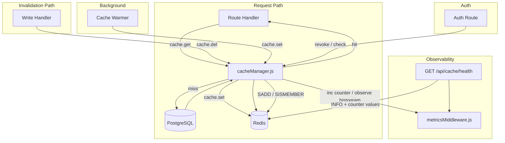

# Design Document — Caching Layer

## Overview

This design formalises and extends the Redis caching layer for the Nova-Rewards backend (issue #358).
The backend already uses Redis for leaderboard caching and rate limiting via raw `client.get/setEx/del`
calls scattered across route files and repositories. This spec introduces two new modules —
`lib/cacheManager.js` and `lib/cacheKeys.js` — that centralise all cache operations behind a typed,
namespace-enforcing API. Existing ad-hoc Redis calls are refactored to use this API. New cache-aside
patterns are added for campaigns, user profiles, token balances, and drops. JWT refresh-token revocation
is tracked in Redis sets. A health endpoint and Prometheus metrics complete the observability story.

### Goals

- Single source of truth for key naming, TTLs, and invalidation logic
- Cache-aside pattern applied consistently across all high-read endpoints
- Prometheus hit/miss/duration metrics for every cache operation
- JWT refresh-token revocation with O(1) lookup
- `GET /api/cache/health` for operator visibility without Redis CLI access
- Property-based tests (fast-check) covering all correctness invariants

### Non-Goals

- Distributed cache invalidation across multiple Node processes (single-process deployment)
- Cache stampede protection / probabilistic early expiry (deferred to a future spec)
- Replacing the existing `rate-limit-redis` store (it stays as-is; this spec only formalises its prefix convention)

---

## Architecture



The `cacheManager` is the single point of contact with Redis for all application-level cache
operations. It wraps the existing `lib/redis.js` client and adds:

1. Key validation (namespace enforcement)
2. Metric recording (hit/miss counters, operation duration histogram)
3. Error isolation (Redis failures are caught and logged; callers receive `null` on get failures)

Rate-limit keys (`rl:global:`, `rl:auth:`) are managed exclusively by `rate-limit-redis` and are
never touched by `cacheManager`.

---

## Components and Interfaces

### `lib/cacheKeys.js`

Exports TTL constants and pure key-builder functions. No Redis dependency.

```js
// TTL constants (seconds)
const TTL = {
  leaderboard:      300,
  campaign:         600,
  userProfile:      120,
  userTokenBalance: 30,
  merchant:         600,
  drop:             120,
  contractEvent:    300,
  authRevoked:      604800,   // 7 days
};

// Key builders — all return fully-qualified keys including namespace
const NAMESPACE = process.env.CACHE_NAMESPACE || 'nova:';

function leaderboardKey(period)      { return `${NAMESPACE}leaderboard:${period}`; }
function campaignKey(merchantId)     { return `${NAMESPACE}campaign:merchant:${merchantId}`; }
function userProfileKey(userId)      { return `${NAMESPACE}user:profile:${userId}`; }
function userTokenBalanceKey(userId) { return `${NAMESPACE}user:tokenBalance:${userId}`; }
function merchantKey(merchantId)     { return `${NAMESPACE}merchant:${merchantId}`; }
function dropEligibleKey(userId)     { return `${NAMESPACE}drop:eligible:${userId}`; }
function contractEventKey(id)        { return `${NAMESPACE}contractEvent:${id}`; }
function authRevokedKey(userId)      { return `${NAMESPACE}auth:revoked:${userId}`; }
```

Key format: `<namespace><resourceType>:<identifier>` where namespace already ends with `:`.
Fully-qualified example: `nova:user:profile:42`.

### `lib/cacheManager.js`

Wraps `lib/redis.js` client. All methods are async and swallow Redis errors (log + return null/false).

```js
// Public API
cache.get(key)                          // → value | null
cache.set(key, value, ttlSeconds)       // → void
cache.del(key)                          // → void
cache.flush(namespacePrefix)            // → void  (SCAN + DEL, never FLUSHDB)
cache.sAdd(key, member, ttlSeconds)     // → void  (for revocation sets)
cache.sIsMember(key, member)            // → boolean
cache.sDeleteKey(key)                   // → void  (delete entire set)
```

Key validation is performed on every call. If the key does not start with the configured namespace
and contain at least two `:` separators (i.e. `<ns><type>:<id>`), a `CacheKeyError` is thrown
synchronously before any Redis I/O.

```js
class CacheKeyError extends Error {
  constructor(key) {
    super(`Invalid cache key: "${key}". Must match <namespace>:<resourceType>:<identifier>`);
    this.name = 'CacheKeyError';
  }
}
```

Metrics are recorded inside each method using the counters/histogram registered in
`metricsMiddleware.js` (see Metrics section).

### `routes/cacheHealth.js`

New route module mounted at `/api/cache/health` (no auth middleware).

```
GET /api/cache/health
→ 200 { status, connected, memoryUsedBytes, memoryPeakBytes, uptimeSeconds,
         hitRate, totalHits, totalMisses }
→ 200 { status: "degraded", connected: false, error? }   (Redis unreachable)
```

Reads Redis `INFO memory` and `INFO server` via `client.info('memory')` / `client.info('server')`.
Hit/miss totals are read from the in-process prom-client counters (not from Redis `INFO stats`),
so they reflect only this process's activity.

### Refactored: `routes/leaderboard.js`

Replace direct `client.get/setEx` calls with `cache.get/set` using `leaderboardKey(period)`.

### Refactored: `jobs/leaderboardCacheWarmer.js`

Replace direct `client.setEx` calls with `cache.set` using `leaderboardKey(period)` and
`TTL.leaderboard`.

### Refactored: `db/transactionRepository.js`

Replace direct `redisClient.del` calls with `cache.del(leaderboardKey('weekly'))` etc.

### Updated: `routes/campaigns.js`

Add cache-aside on `GET /api/campaigns` and `GET /api/campaigns/:merchantId`.
Add `cache.del(campaignKey(merchantId))` after successful `POST /api/campaigns`.

### Updated: `routes/users.js`

- `GET /api/users/:id` — cache-aside with `userProfileKey(userId)`, TTL 120 s.
- `GET /api/users/:id/token-balance` — migrate existing ad-hoc cache to `cache.get/set` with
  `userTokenBalanceKey(userId)`, TTL 30 s.
- `PATCH /api/users/:id` — add `cache.del(userProfileKey(userId))` after successful update.
- `DELETE /api/users/:id` — add `cache.del(userProfileKey(userId))` after successful soft-delete.

### Updated: `routes/drops.js`

- `GET /api/drops/eligible` — cache-aside with `dropEligibleKey(userId)`, TTL 120 s.
- `POST /api/drops/:id/claim` — add `cache.del(dropEligibleKey(userId))` after successful claim.

### Updated: `routes/auth.js`

- `POST /api/auth/logout` — `cache.sAdd(authRevokedKey(userId), jti, remainingTtl)`.
- `POST /api/auth/refresh` — `cache.sIsMember(authRevokedKey(userId), jti)` → 401 if true.

### Updated: `middleware/metricsMiddleware.js`

Register three new prom-client instruments (exported alongside existing `registry`):

```js
const cacheHitsTotal = new Counter({
  name: 'cache_hits_total',
  help: 'Total cache hits',
  labelNames: ['resource'],
  registers: [registry],
});

const cacheMissesTotal = new Counter({
  name: 'cache_misses_total',
  help: 'Total cache misses',
  labelNames: ['resource'],
  registers: [registry],
});

const cacheOperationDuration = new Histogram({
  name: 'cache_operation_duration_seconds',
  help: 'Duration of Redis cache operations',
  labelNames: ['operation', 'resource'],
  registers: [registry],
});
```

`cacheManager` imports these from `metricsMiddleware` to avoid a circular dependency
(`metricsMiddleware` does not import `cacheManager`).

### Updated: `server.js`

Mount the new health route:

```js
app.use('/api/cache', require('./routes/cacheHealth'));
```

---

## Data Models

### Cache Key Structure

```
<namespace><resourceType>:<identifier>
│           │              │
│           │              └─ non-empty string (userId, merchantId, period, etc.)
│           └─ dot-free resource segment (e.g. "user:profile", "leaderboard")
└─ configured prefix, default "nova:" (ends with ":")
```

Examples:

| Resource              | Key                                  | TTL   |
|-----------------------|--------------------------------------|-------|
| Leaderboard weekly    | `nova:leaderboard:weekly`            | 300 s |
| Leaderboard alltime   | `nova:leaderboard:alltime`           | 300 s |
| Campaign (merchant 7) | `nova:campaign:merchant:7`           | 600 s |
| User profile (id 42)  | `nova:user:profile:42`               | 120 s |
| Token balance (id 42) | `nova:user:tokenBalance:42`          | 30 s  |
| Drop eligible (id 5)  | `nova:drop:eligible:5`               | 120 s |
| Auth revoked (user 3) | `nova:auth:revoked:3`                | 604800 s |

### Revocation Set

Redis type: `SET`  
Key: `nova:auth:revoked:<userId>`  
Members: JWT JTI strings (UUID v4)  
TTL: set to `max(remainingLifetime)` across all members on each `SADD`

### Health Response Schema

```json
{
  "status": "ok" | "degraded",
  "connected": true,
  "memoryUsedBytes": 1048576,
  "memoryPeakBytes": 2097152,
  "uptimeSeconds": 86400,
  "hitRate": 0.94,
  "totalHits": 4712,
  "totalMisses": 301
}
```

Degraded response (Redis unreachable):

```json
{
  "status": "degraded",
  "connected": false,
  "error": "connect ECONNREFUSED 127.0.0.1:6379"
}
```

---

## Correctness Properties

*A property is a characteristic or behavior that should hold true across all valid executions of a
system — essentially, a formal statement about what the system should do. Properties serve as the
bridge between human-readable specifications and machine-verifiable correctness guarantees.*

### Property 1: Key Construction Correctness

*For any* valid `(resourceType, identifier)` pair, the key builder must produce a string that (a)
starts with the configured namespace prefix and (b) contains the resourceType and identifier
separated by `:`, yielding exactly the pattern `<namespace><resourceType>:<identifier>`.

**Validates: Requirements 1.1, 1.3, 9.1**

---

### Property 2: Cache Round-Trip

*For any* valid cache key `k` and serialisable value `v`, calling `cache.set(k, v, ttl)` followed
immediately by `cache.get(k)` (before TTL expiry) must return a value deeply equal to `v`.

**Validates: Requirements 2.1–2.9, 9.2**

---

### Property 3: Invalidation Correctness

*For any* valid cache key `k` that has a stored value, calling `cache.del(k)` followed by
`cache.get(k)` must return `null`.

**Validates: Requirements 3.1–3.5, 9.3**

---

### Property 4: Last-Write-Wins

*For any* valid cache key `k` and any sequence of `set` operations `[v1, v2, …, vN]` on `k`,
`cache.get(k)` after the sequence must return a value deeply equal to `vN` (the last written value).

**Validates: Requirements 9.4**

---

### Property 5: Revocation Membership Invariant

*For any* user `u` and JTI `j`, after `cache.sAdd(authRevokedKey(u), j, ttl)`,
`cache.sIsMember(authRevokedKey(u), j)` must return `true`, regardless of the order in which
other JTIs were added or removed.

**Validates: Requirements 4.1, 4.2, 9.5**

---

### Property 6: Revocation Set Replacement

*For any* user `u` with an existing revocation set containing JTIs `[j1, j2, …]`, after replacing
the set with a new set of JTIs `[jA, jB, …]`, `sIsMember` must return `true` for every new JTI
and `false` for every old JTI not in the new set.

**Validates: Requirements 4.5**

---

### Property 7: Namespace Flush Clears All Matching Keys

*For any* set of cache keys written under a given namespace prefix, calling `cache.flush(prefix)`
must result in `cache.get(k)` returning `null` for every key `k` that matched the prefix.

**Validates: Requirements 3.6**

---

### Property 8: Metrics Counter Monotonicity

*For any* sequence of cache operations, the values of `cache_hits_total` and `cache_misses_total`
must be monotonically non-decreasing, and the sum `totalHits + totalMisses` must equal the total
number of `cache.get` calls made.

**Validates: Requirements 7.3, 7.4, 9.6, 9.7**

---

### Property 9: Cache Warmer Idempotence

*For any* fixed database state, running the cache warmer twice in succession must produce identical
values for all warmed cache keys (i.e. the second run overwrites with the same data, not different
data).

**Validates: Requirements 8.4, 9.8**

---

### Property 10: Invalid Key Throws CacheKeyError

*For any* string that does not match the pattern `<namespace><resourceType>:<identifier>` (e.g.
missing namespace prefix, empty identifier, fewer than two `:` separators), every `cacheManager`
method must throw a `CacheKeyError` synchronously before performing any Redis I/O.

**Validates: Requirements 1.4**

---

## Error Handling

| Scenario | Behaviour |
|---|---|
| Redis unavailable on `cache.get` | Log error, return `null`; caller falls through to DB |
| Redis unavailable on `cache.set` | Log error, swallow; response is still returned to client |
| Redis unavailable on `cache.del` | Log error, swallow; originating write operation completes |
| Redis unavailable on `cache.flush` | Log error, swallow |
| `CacheKeyError` thrown | Propagates to caller (programming error, not a runtime Redis error) |
| Redis `INFO` fails in health endpoint | Return `{ status: "degraded", error: message }` |
| DB query fails in cache warmer | Log error, continue warming remaining resources |
| Revocation `SADD` fails | Log error, swallow; logout still succeeds (conservative: token may still work until TTL) |
| Revocation `SISMEMBER` fails | Log error, **deny** the refresh request (fail-closed for security) |

The fail-closed behaviour on `SISMEMBER` failure is a deliberate security decision: if we cannot
confirm a token is not revoked, we must reject it.

---

## Testing Strategy

### Unit Tests (Jest)

Focus on specific examples, edge cases, and error conditions:

- `cacheKeys.js`: assert each key builder returns the expected string for known inputs; assert TTL
  constants match the spec values.
- `cacheManager.js` (with mocked Redis client):
  - `get` returns parsed value on hit, `null` on miss, `null` on Redis error.
  - `set` calls `setEx` with correct key and TTL.
  - `del` calls `del` on the correct key.
  - `flush` uses `SCAN` + `DEL` (never `FLUSHDB`).
  - `sAdd` / `sIsMember` / `sDeleteKey` call the correct Redis commands.
  - `CacheKeyError` is thrown for invalid keys.
  - Metrics counters are incremented on hit/miss.
- `routes/cacheHealth.js` (with mocked Redis and metrics):
  - Returns `200 ok` with all fields when Redis is connected.
  - Returns `200 degraded` with `connected: false` when Redis is unreachable.
  - Returns `200 degraded` with `error` field when `INFO` fails.
- Integration smoke tests for each refactored route (mock DB + mock Redis):
  - Cache hit path skips DB call.
  - Cache miss path calls DB and stores result.
  - Invalidation path calls `cache.del` after write.

### Property-Based Tests (fast-check)

Each property test runs a minimum of 100 iterations. Tests are tagged with a comment referencing
the design property they validate.

**Tag format:** `// Feature: caching-layer, Property N: <property_text>`

| Property | fast-check arbitraries | Assertion |
|---|---|---|
| P1 — Key construction | `fc.string()` for resourceType and identifier (filtered to non-empty, no `:`) | Output starts with namespace, contains both segments |
| P2 — Cache round-trip | `fc.string()` for key (valid format), `fc.jsonValue()` for value | `get(set(k,v)) deepEqual v` |
| P3 — Invalidation | `fc.string()` for key, `fc.jsonValue()` for value | `get(del(set(k,v))) === null` |
| P4 — Last-write-wins | `fc.array(fc.jsonValue(), {minLength:2})` for value sequence | `get` returns last element |
| P5 — Revocation membership | `fc.uuid()` for userId, `fc.array(fc.uuid())` for JTIs | `sIsMember` true for added JTI |
| P6 — Revocation set replacement | `fc.uuid()` for userId, two `fc.array(fc.uuid())` for old/new sets | Old JTIs absent, new JTIs present |
| P7 — Namespace flush | `fc.array(validKey)` for key set | All keys null after flush |
| P8 — Metrics monotonicity | `fc.array(fc.oneof(hit, miss))` for operation sequence | Counters non-decreasing, sum equals call count |
| P9 — Warmer idempotence | Fixed DB state mock | Two warm runs produce identical cached values |
| P10 — Invalid key error | `fc.string()` filtered to invalid patterns | Every method throws `CacheKeyError` |

Properties P2–P9 use an in-memory Redis mock (e.g. `ioredis-mock` or a hand-rolled Map-based stub)
so tests run without a live Redis instance. P1 and P10 test pure functions in `cacheKeys.js` and
`cacheManager.js` key validation with no Redis dependency.
