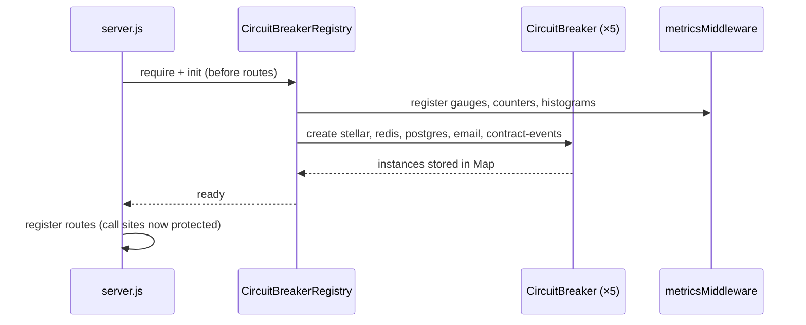
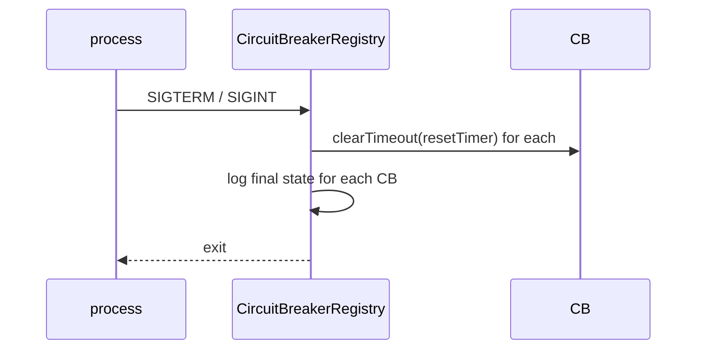

# Design Document: Circuit Breaker

## Overview

The Circuit Breaker feature adds a resilience layer to the Nova-Rewards backend by wrapping all five external service calls — Stellar/Horizon, Redis, PostgreSQL, Email (SendGrid/SMTP), and contract event polling — in a state-machine-based circuit breaker. When a dependency fails repeatedly, the circuit opens and subsequent calls fail fast with a configured fallback, preventing cascading failures. The circuit periodically probes for recovery (half-open state) and closes again on success. Retry logic with exponential backoff + jitter and per-call `Promise.race` timeouts are built in. All state transitions and call outcomes are exposed as Prometheus metrics through the existing `prom-client` registry.

The implementation lives entirely in `lib/` and is integrated into existing call sites with minimal changes. No third-party circuit breaker library is introduced; the implementation is from scratch to match the project's exact requirements.

## Architecture

```mermaid
graph TD
    subgraph "Call Sites"
        A[blockchain/sendRewards.js]
        B[blockchain/trustline.js]
        C[lib/redis.js]
        D[db/index.js]
        E[services/emailService.js]
        F[services/contractEventService.js]
    end

    subgraph "lib/"
        R[circuitBreakerRegistry.js<br/>singleton]
        CB[circuitBreaker.js<br/>CircuitBreaker class]
        M[metricsMiddleware.js<br/>existing registry]
    end

    A -->|registry.get('stellar').fire(fn)| R
    B -->|registry.get('stellar').fire(fn)| R
    C -->|registry.get('redis').fire(fn)| R
    D -->|registry.get('postgres').fire(fn)| R
    E -->|registry.get('email').fire(fn)| R
    F -->|registry.get('contract-events').fire(fn)| R

    R --> CB
    CB -->|state gauge, call counter, duration histogram| M

    subgraph "State Machine (per CB)"
        CLOSED -->|failures >= threshold| OPEN
        OPEN -->|resetTimeout elapsed| HALF_OPEN
        HALF_OPEN -->|probe success| CLOSED
        HALF_OPEN -->|probe failure| OPEN
    end
```

### Startup Sequence



### Shutdown Sequence



## Components and Interfaces

### `lib/circuitBreaker.js` — `CircuitBreaker` class

The core state machine. Callers interact exclusively through `fire(fn, ...args)`.

```js
class CircuitBreaker {
  /**
   * @param {string} name - Service name (e.g. 'stellar')
   * @param {object} config - Validated config object
   * @param {object} metrics - { stateGauge, callsCounter, durationHistogram }
   */
  constructor(name, config, metrics) {}

  /**
   * Execute fn(...args) with timeout, retry, and circuit-breaker protection.
   * Returns the result or invokes the fallback.
   * @param {Function} fn - Async function to protect
   * @param {...*} args - Arguments forwarded to fn
   * @returns {Promise<*>}
   */
  async fire(fn, ...args) {}

  /**
   * Register a fallback. value may be a static value or async function.
   * @param {*|Function} value
   */
  setFallback(value) {}

  /** Force back to CLOSED and reset all counters. */
  reset() {}

  /** Returns { state, failureCount, config } */
  getState() {}
}
```

Internal state fields:

| Field | Type | Description |
|---|---|---|
| `_state` | `'CLOSED' \| 'OPEN' \| 'HALF_OPEN'` | Current state |
| `_failureCount` | `number` | Consecutive failures in CLOSED |
| `_resetTimer` | `NodeJS.Timeout \| null` | Timer for OPEN → HALF_OPEN transition |
| `_probeInFlight` | `number` | Active probe calls in HALF_OPEN |
| `_fallback` | `* \| Function \| null` | Registered fallback |

### `lib/circuitBreakerRegistry.js` — `CircuitBreakerRegistry` singleton

Owns all five `CircuitBreaker` instances and handles configuration resolution.

```js
class CircuitBreakerRegistry {
  /**
   * Initialise all circuit breakers. Must be called once before routes load.
   * Reads env vars, validates config, registers metrics, wires SIGTERM/SIGINT.
   * @param {object} [overrides] - Per-service config overrides (for tests)
   */
  init(overrides = {}) {}

  /**
   * Retrieve a named circuit breaker.
   * @param {string} name - One of: stellar, redis, postgres, email, contract-events
   * @returns {CircuitBreaker}
   */
  get(name) {}

  /**
   * Returns { state, failureCount, config } for a named circuit breaker.
   * @param {string} name
   */
  getState(name) {}

  /**
   * Force a named circuit breaker to CLOSED and reset counters.
   * @param {string} name
   */
  reset(name) {}
}

module.exports = new CircuitBreakerRegistry(); // singleton export
```

### Call-site integration pattern

Each protected call site wraps its outbound I/O call using `registry.get(name).fire(fn, ...args)`. The call site itself does not change its public API.

**Example — `db/index.js`:**
```js
const registry = require('./lib/circuitBreakerRegistry');

async function query(text, params) {
  return registry.get('postgres').fire(() => pool.query(text, params));
}
```

**Example — `lib/redis.js` (selected operations):**
```js
async function get(key) {
  return registry.get('redis').fire(() => client.get(key));
}
```

**Example — `blockchain/sendRewards.js`:**
```js
const registry = require('../backend/lib/circuitBreakerRegistry');

// Inside distributeRewards, wrap the Horizon submit call:
const result = await registry.get('stellar').fire(() => server.submitTransaction(transaction));
```

### Timeout enforcement

```js
// Inside CircuitBreaker._callWithTimeout(fn, args)
const timeoutPromise = new Promise((_, reject) => {
  const t = setTimeout(() => {
    const err = new Error(`Call timeout after ${this._config.callTimeout}ms`);
    err.code = 'CALL_TIMEOUT';
    err.service = this._name;
    err.durationMs = this._config.callTimeout;
    reject(err);
  }, this._config.callTimeout);
  // store t for potential cleanup
});
return Promise.race([fn(...args), timeoutPromise]);
```

### Retry + backoff + jitter

```js
// Inside CircuitBreaker._executeWithRetry(fn, args)
for (let attempt = 0; attempt <= maxAttempts; attempt++) {
  try {
    return await this._callWithTimeout(fn, args);
  } catch (err) {
    if (attempt === maxAttempts) throw err;
    const base = baseDelayMs * Math.pow(2, attempt);
    const jitter = Math.random() * base * 0.2;
    await sleep(base + jitter);
  }
}
```

### Prometheus metrics wiring

Three metrics are registered against the existing `registry` from `metricsMiddleware.js`:

| Metric | Type | Labels |
|---|---|---|
| `circuit_breaker_state` | Gauge | `service` |
| `circuit_breaker_calls_total` | Counter | `service`, `outcome` |
| `circuit_breaker_call_duration_seconds` | Histogram | `service` |

`outcome` values: `success`, `failure`, `fallback`, `timeout`, `rejected`

State encoding: `0` = CLOSED, `1` = HALF_OPEN, `2` = OPEN

### Per-service fallbacks

| Service | Fallback behaviour |
|---|---|
| `stellar` | Returns `{ success: false, error: 'stellar_unavailable', retryAfter: <resetTimeout> }` |
| `redis` | Returns `null` for reads; no-op `undefined` for writes |
| `postgres` | Throws `{ code: 'DB_UNAVAILABLE' }` → route handler returns HTTP 503 |
| `email` | Enqueues payload to Redis list `email:retry_queue` via `client.lPush` |
| `contract-events` | Logs warning and returns `[]` (polling loop continues) |

## Data Models

### Configuration object (per circuit breaker)

```ts
interface CircuitBreakerConfig {
  failureThreshold: number;   // integer >= 1, default 5
  resetTimeout:     number;   // ms >= 100, default 30000
  probeCount:       number;   // integer >= 1, default 1
  callTimeout:      number;   // ms >= 1, default 5000
  retryPolicy: {
    maxAttempts:  number;     // integer >= 0, default 3
    baseDelayMs:  number;     // integer >= 0, default 200
  };
}
```

### Environment variable naming convention

`CB_<SERVICE_NAME_UPPER>_<PARAM_UPPER>` where `SERVICE_NAME` replaces hyphens with underscores.

| Variable | Maps to |
|---|---|
| `CB_STELLAR_FAILURE_THRESHOLD` | `stellar.failureThreshold` |
| `CB_STELLAR_RESET_TIMEOUT` | `stellar.resetTimeout` |
| `CB_STELLAR_PROBE_COUNT` | `stellar.probeCount` |
| `CB_STELLAR_CALL_TIMEOUT` | `stellar.callTimeout` |
| `CB_STELLAR_RETRY_MAX_ATTEMPTS` | `stellar.retryPolicy.maxAttempts` |
| `CB_STELLAR_RETRY_BASE_DELAY_MS` | `stellar.retryPolicy.baseDelayMs` |
| `CB_REDIS_*`, `CB_POSTGRES_*`, `CB_EMAIL_*`, `CB_CONTRACT_EVENTS_*` | same pattern |

### State transition log entry (structured log)

```ts
interface StateChangeLog {
  event:        'circuit_state_change';
  service:      string;
  fromState:    'CLOSED' | 'OPEN' | 'HALF_OPEN';
  toState:      'CLOSED' | 'OPEN' | 'HALF_OPEN';
  failureCount: number;
  timestamp:    string; // ISO 8601
}
```

### Error shapes

```ts
// Open circuit rejection
interface CircuitOpenError extends Error {
  code:       'CIRCUIT_OPEN';
  service:    string;
  retryAfter: number; // ms
}

// Timeout rejection
interface CallTimeoutError extends Error {
  code:       'CALL_TIMEOUT';
  service:    string;
  durationMs: number;
}
```

### HTTP 503 response body (route handlers)

```ts
interface ServiceUnavailableResponse {
  success:    false;
  error:      'CIRCUIT_OPEN' | 'DB_UNAVAILABLE';
  message:    string;
  retryAfter: number; // ms
}
```


## Correctness Properties

*A property is a characteristic or behavior that should hold true across all valid executions of a system — essentially, a formal statement about what the system should do. Properties serve as the bridge between human-readable specifications and machine-verifiable correctness guarantees.*

### Property 1: State is always one of three valid values

*For any* circuit breaker and any sequence of successful and failing calls, the state after each call must be exactly one of `CLOSED`, `OPEN`, or `HALF_OPEN` — never undefined, null, or any other value.

**Validates: Requirements 1.1**

---

### Property 2: Consecutive failures at threshold trip the circuit

*For any* circuit breaker with a valid `failureThreshold` N, after exactly N consecutive failures the state must be `OPEN`.

**Validates: Requirements 1.2**

---

### Property 3: Reset timeout transitions OPEN → HALF_OPEN

*For any* circuit breaker in `OPEN` state with a valid `resetTimeout` T, after T milliseconds have elapsed the state must be `HALF_OPEN`.

**Validates: Requirements 1.3**

---

### Property 4: Successful probe closes the circuit and resets failure count

*For any* circuit breaker in `HALF_OPEN` state, when a probe call succeeds the state must become `CLOSED` and `failureCount` must be `0`.

**Validates: Requirements 1.4**

---

### Property 5: Failed probe returns to OPEN

*For any* circuit breaker in `HALF_OPEN` state, when a probe call fails the state must return to `OPEN`.

**Validates: Requirements 1.5**

---

### Property 6: Successful call in CLOSED resets failure counter

*For any* circuit breaker in `CLOSED` state with a non-zero failure count (below threshold), when a call succeeds the `failureCount` must become `0`.

**Validates: Requirements 1.6**

---

### Property 7: Out-of-range config values throw RangeError at init

*For any* configuration object where at least one value is outside its valid range (e.g. `failureThreshold < 1`, `resetTimeout < 100`, `probeCount < 1`, `callTimeout < 1`, `maxAttempts < 0`, `baseDelayMs < 0`), calling `registry.init()` must throw a `RangeError` with a descriptive message.

**Validates: Requirements 2.4**

---

### Property 8: Fallback is invoked and external function is not called when OPEN

*For any* circuit breaker in `OPEN` state with a registered fallback, calling `fire(fn, ...args)` must invoke the fallback and must not invoke `fn`.

**Validates: Requirements 3.1**

---

### Property 9: Throwing fallback propagates error without changing circuit state

*For any* circuit breaker in `OPEN` state with a fallback that throws, calling `fire()` must propagate the fallback's error to the caller and the circuit state must remain `OPEN`.

**Validates: Requirements 3.4**

---

### Property 10: Retry count matches maxAttempts

*For any* circuit breaker in `CLOSED` state with `retryPolicy.maxAttempts` = N and a function that always fails, the function must be called exactly N + 1 times before the failure is recorded against the threshold.

**Validates: Requirements 4.1**

---

### Property 11: Backoff delay follows exponential formula within jitter bounds

*For any* retry attempt number A and `baseDelayMs` B, the actual delay before attempt A must be in the range `[B * 2^(A-1), B * 2^(A-1) * 1.2]`.

**Validates: Requirements 4.2, 4.5**

---

### Property 12: Timeout enforcement — call rejects with CALL_TIMEOUT after callTimeout ms

*For any* circuit breaker with `callTimeout` = T and a function that never resolves, calling `fire()` must reject with an error where `code === 'CALL_TIMEOUT'`, `service` equals the circuit breaker's name, and `durationMs` is approximately T.

**Validates: Requirements 5.1, 5.2**

---

### Property 13: State gauge value matches circuit state after every transition

*For any* circuit breaker and any sequence of calls that causes state transitions, the Prometheus `circuit_breaker_state` gauge value for that service must equal `0` when `CLOSED`, `1` when `HALF_OPEN`, and `2` when `OPEN` — immediately after each transition.

**Validates: Requirements 7.3**

---

### Property 14: Call outcome counter increments with correct labels

*For any* call outcome (success, failure, fallback, timeout, rejected), the `circuit_breaker_calls_total` counter for the service and that outcome label must increment by exactly 1.

**Validates: Requirements 7.4**

---

### Property 15: getState reflects current state and failure count

*For any* circuit breaker, the value returned by `registry.getState(name)` must always equal the circuit breaker's actual internal state and failure count at the time of the call.

**Validates: Requirements 8.4**

---

### Property 16: reset() always returns circuit to CLOSED with zero failure count

*For any* circuit breaker in any state with any failure count, calling `registry.reset(name)` must result in state `CLOSED` and `failureCount === 0`.

**Validates: Requirements 8.5**

---

### Property 17: CIRCUIT_OPEN error shape is always complete

*For any* open-circuit rejection, the thrown error must have `code === 'CIRCUIT_OPEN'`, a `service` field matching the circuit breaker name, and a numeric `retryAfter` field equal to the configured `resetTimeout`.

**Validates: Requirements 9.1**

---

### Property 18: CALL_TIMEOUT error shape is always complete

*For any* timeout rejection, the thrown error must have `code === 'CALL_TIMEOUT'`, a `service` field matching the circuit breaker name, and a numeric `durationMs` field.

**Validates: Requirements 9.2**

---

### Property 19: State transition log entries contain all required fields

*For any* state transition, the structured log entry emitted at `warn` level must contain `event`, `service`, `fromState`, `toState`, `failureCount`, and `timestamp` fields.

**Validates: Requirements 9.3**

---

## Error Handling

### Circuit-level errors

| Error code | When thrown | HTTP status |
|---|---|---|
| `CIRCUIT_OPEN` | Circuit is OPEN and no fallback registered | 503 |
| `CALL_TIMEOUT` | Call exceeds `callTimeout` ms | 503 (if unhandled) |
| `DB_UNAVAILABLE` | postgres fallback throws | 503 |

### Route handler responsibility

Route handlers that call protected services must catch `CIRCUIT_OPEN` and `DB_UNAVAILABLE` errors and return:

```json
{
  "success": false,
  "error": "CIRCUIT_OPEN",
  "message": "Service temporarily unavailable",
  "retryAfter": 30000
}
```

The global error handler in `server.js` already handles unhandled errors with a 500 response. Circuit breaker errors should be caught at the route level to return 503 specifically.

### Fallback error isolation

If a fallback function itself throws, the error propagates to the caller unchanged. The circuit state is not modified. This prevents a broken fallback from masking the original circuit state.

### Retry exhaustion

When all retry attempts are exhausted, the failure is recorded against the threshold exactly once (not once per attempt). This prevents a single logical failure from prematurely tripping the circuit.

### Graceful shutdown

On `SIGTERM`/`SIGINT`, all `resetTimer` handles are cleared via `clearTimeout`. This prevents the Node.js process from hanging due to pending timers. Final state is logged at `warn` level for each circuit breaker.

## Testing Strategy

### Dual testing approach

Both unit tests and property-based tests are required. They are complementary:

- **Unit tests** cover specific examples, integration points, and edge cases (e.g. default config values, HTTP 503 responses, service-specific fallbacks, metrics registration).
- **Property-based tests** verify universal invariants across randomly generated inputs (e.g. state machine correctness, retry counts, backoff bounds, error shapes).

### Property-based testing

**Library**: `fast-check` (already in `devDependencies` at `^3.23.2`)

**Configuration**: Each property test must run a minimum of **100 iterations** (`numRuns: 100` in `fc.assert`).

**Tag format**: Each property test must include a comment:
```
// Feature: circuit-breaker, Property <N>: <property_text>
```

**One test per property**: Each of the 19 correctness properties above must be implemented by exactly one `fc.assert` / `fc.property` call.

**Arbitraries to define**:
- `validConfig` — generates a `CircuitBreakerConfig` with all fields in valid ranges
- `invalidConfig` — generates a config with at least one field out of range
- `callSequence` — generates an array of `{ succeeds: boolean }` call descriptors
- `serviceName` — `fc.constantFrom('stellar', 'redis', 'postgres', 'email', 'contract-events')`

**Example property test structure**:
```js
// Feature: circuit-breaker, Property 2: Consecutive failures at threshold trip the circuit
it('trips to OPEN after failureThreshold consecutive failures', () => {
  fc.assert(
    fc.property(
      fc.integer({ min: 1, max: 10 }), // failureThreshold
      (threshold) => {
        const cb = new CircuitBreaker('test', { ...defaults, failureThreshold: threshold }, mockMetrics);
        for (let i = 0; i < threshold; i++) {
          // inject failure
        }
        expect(cb.getState().state).toBe('OPEN');
      }
    ),
    { numRuns: 100 }
  );
});
```

### Unit test coverage targets

| Area | Test type | File |
|---|---|---|
| Default config values | example | `tests/circuitBreaker.test.js` |
| Env var config resolution | example | `tests/circuitBreakerRegistry.test.js` |
| Service-specific fallbacks (stellar, redis, postgres, email) | example | `tests/circuitBreakerFallbacks.test.js` |
| Metrics registration (gauge, counter, histogram on existing registry) | example | `tests/circuitBreakerMetrics.test.js` |
| HTTP 503 on CIRCUIT_OPEN (rewards, trustline routes) | example | `tests/circuitBreakerRoutes.test.js` |
| SIGTERM/SIGINT shutdown | example | `tests/circuitBreakerRegistry.test.js` |
| All 19 correctness properties | property | `tests/circuitBreakerProperties.test.js` |

### Edge cases to cover explicitly

- `maxAttempts = 0` — no retry, immediate failure recording (Property 10 edge case)
- Timeout during a retry attempt — timeout counted as failure, next retry proceeds (Property 12 edge case)
- Probe call timeout in HALF_OPEN — treated as probe failure, returns to OPEN (Property 5 edge case)
- Fallback that itself throws — error propagates, state unchanged (Property 9)
- `reset()` called while OPEN with active `resetTimer` — timer is cleared, state becomes CLOSED (Property 16)
