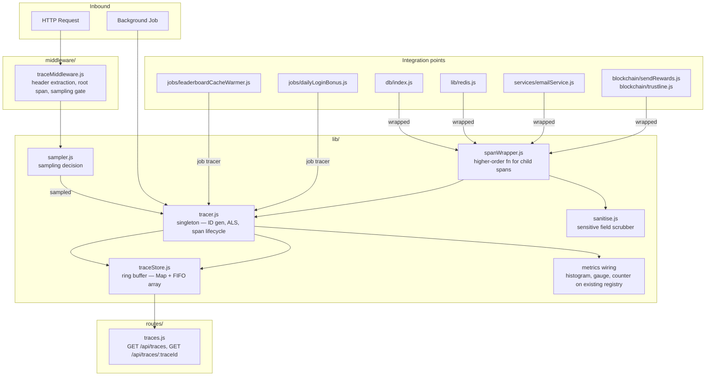
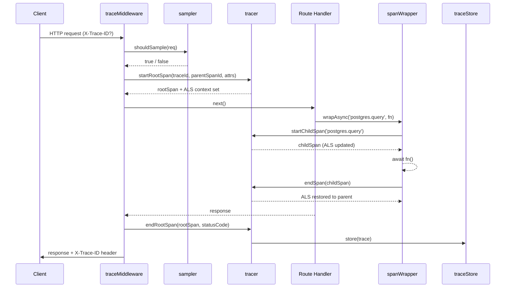
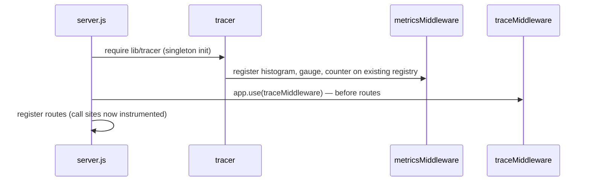

# Design Document: Distributed Tracing

## Overview

The Distributed Tracing feature adds end-to-end request observability to the Nova-Rewards backend without introducing any third-party tracing SDK. Every inbound HTTP request receives a unique Trace_ID propagated through all downstream calls — PostgreSQL, Redis, Stellar/Horizon, and email — as well as across background jobs. Each unit of work is recorded as a Span with timing, status, and sanitised metadata. Completed traces are stored in a lightweight in-process ring buffer and exposed through an admin-only visualization API. A configurable sampler controls overhead in production. All span duration metrics are wired into the existing `prom-client` registry.

The implementation is entirely in `lib/` and `middleware/`, integrated into existing call sites with minimal changes. The only Node.js built-ins used are `crypto` (ID generation) and `async_hooks` (`AsyncLocalStorage` for context propagation).

## Architecture



### Request lifecycle



### Startup wiring



## Components and Interfaces

### `lib/tracer.js` — Tracer singleton

The central module. Owns `AsyncLocalStorage`, ID generation, and span lifecycle.

```js
const tracer = {
  /**
   * Generate a 32-char lowercase hex Trace_ID.
   * Throws { code: 'TRACE_ID_GENERATION_FAILED' } on crypto failure.
   * @returns {string}
   */
  generateTraceId(),

  /**
   * Generate a 16-char lowercase hex Span_ID.
   * Throws { code: 'TRACE_ID_GENERATION_FAILED' } on crypto failure.
   * @returns {string}
   */
  generateSpanId(),

  /**
   * Returns the active Trace_Context from AsyncLocalStorage, or null.
   * @returns {{ traceId, spanId, parentSpanId } | null}
   */
  getContext(),

  /**
   * Create and activate a root span. Sets ALS context.
   * @param {string} traceId
   * @param {string|null} parentSpanId  - from upstream X-Span-ID header
   * @param {object} attrs              - initial span attributes
   * @returns {{ spanId, traceId, parentSpanId, name, startHr, attrs, error }}
   */
  startRootSpan(traceId, parentSpanId, attrs),

  /**
   * Create a child span nested under the currently active span.
   * Updates ALS so further nested spans use this span as parent.
   * @param {string} name
   * @param {object} [attrs]
   * @returns {{ spanId, traceId, parentSpanId, name, startHr, attrs, error }}
   */
  startChildSpan(name, attrs),

  /**
   * End a span: compute duration, update metrics, restore ALS parent context.
   * @param {object} span
   * @param {{ error?: boolean, errorMessage?: string, attrs?: object }} [outcome]
   */
  endSpan(span, outcome),

  /**
   * Run fn inside a new ALS context seeded with the given Trace_Context.
   * Used by background job tracer to isolate job context.
   * @param {{ traceId, spanId, parentSpanId }} context
   * @param {Function} fn
   * @returns {Promise<*>}
   */
  runInContext(context, fn),
};

module.exports = tracer;
```

Internal ALS value shape: `{ traceId, spanId, parentSpanId }` — immutable per async frame; replaced (not mutated) when a child span is entered.

### `lib/traceStore.js` — Ring buffer

Stores the N most recently completed traces. Uses a `Map` for O(1) lookup and an insertion-order array for FIFO eviction.

```js
class TraceStore {
  /**
   * @param {number} maxSize - Maximum number of traces to retain (default 1000)
   */
  constructor(maxSize),

  /**
   * Add a completed trace. Evicts oldest if at capacity.
   * @param {{ traceId: string, spans: object[], startTime: number, durationMs: number }} trace
   */
  add(trace),

  /**
   * Retrieve a trace by Trace_ID. Returns null if not found.
   * @param {string} traceId
   * @returns {object|null}
   */
  get(traceId),

  /**
   * Return the N most recent trace summaries, newest first.
   * @param {{ limit?: number, offset?: number }} opts
   * @returns {object[]}
   */
  list(opts),

  /** Current number of stored traces. */
  get size(),
}

module.exports = new TraceStore(
  Number(process.env.TRACE_STORE_MAX_SIZE) || 1000
);
```

Internal structure:

| Field | Type | Purpose |
|---|---|---|
| `_map` | `Map<string, object>` | O(1) lookup by traceId |
| `_order` | `string[]` | Insertion-order array of traceIds for FIFO eviction |
| `_maxSize` | `number` | Capacity limit |

Eviction: when `_order.length >= _maxSize`, shift the first element from `_order` and delete it from `_map` before inserting the new trace.

### `lib/sampler.js` — Sampling decision

```js
const sampler = {
  /**
   * Returns true if this request should be traced.
   * Upstream X-Trace-ID always forces sampling regardless of rate.
   * @param {{ hasUpstreamTraceId: boolean }} opts
   * @returns {boolean}
   */
  shouldSample(opts),

  /** Effective sampling rate after clamping. */
  get rate(),
};

module.exports = sampler;
```

Rate resolution order:
1. `TRACE_SAMPLING_RATE` env var (parsed as float, clamped to [0.0, 1.0] with warning if out of range)
2. Default: `1.0` when `NODE_ENV !== 'production'`, `0.1` when `NODE_ENV === 'production'`

Decision: `Math.random() < rate` — evaluated once per request at root span creation time.

### `middleware/traceMiddleware.js` — Express middleware

```js
/**
 * Extracts or generates Trace_Context, applies sampling gate,
 * creates root span, attaches X-Trace-ID response header.
 */
function traceMiddleware(req, res, next)

module.exports = traceMiddleware;
```

Processing steps:
1. Extract `X-Trace-ID` from request headers; validate against `/^[0-9a-f]{32}$/`; generate new ID if absent or invalid.
2. Extract `X-Span-ID` as `parentSpanId` (no format validation required — used as-is or ignored if absent).
3. Set `res.setHeader('X-Trace-ID', traceId)` unconditionally.
4. Call `sampler.shouldSample({ hasUpstreamTraceId: !!validIncomingTraceId })`.
5. If not sampled: call `next()` and return.
6. Create root span via `tracer.startRootSpan(traceId, parentSpanId, { 'http.method': req.method, 'http.url': req.path, 'http.route': '' })`.
7. Hook `res.on('finish', ...)` to end the root span, set `http.status_code` and `span.error` for 4xx/5xx, then call `traceStore.add(buildTrace(rootSpan, collectedChildSpans))`.
8. Call `next()`.

Child spans created during the request are collected via a request-scoped array attached to `res.locals.traceSpans` and populated by `spanWrapper`.

### `lib/spanWrapper.js` — Higher-order function

```js
/**
 * Wraps an async function with a child span.
 *
 * @param {string} spanName       - e.g. 'postgres.query', 'redis.get'
 * @param {object} attrs          - sanitised span attributes
 * @param {Function} fn           - async function to wrap
 * @returns {Promise<*>}          - resolves/rejects with fn's result/error
 */
async function withSpan(spanName, attrs, fn)

module.exports = { withSpan };
```

Behaviour:
1. Call `tracer.startChildSpan(spanName, sanitise(attrs))`.
2. `await fn()` inside a try/catch.
3. On success: call `tracer.endSpan(span, { error: false })`.
4. On error: call `tracer.endSpan(span, { error: true, errorMessage: err.message })`, then re-throw.

### `lib/sanitise.js` — Sensitive data scrubber

```js
/**
 * Returns a new object with sensitive fields removed and long values truncated.
 * @param {object} attrs
 * @returns {object}
 */
function sanitise(attrs)

module.exports = { sanitise };
```

Rules applied in order:
1. Remove any key whose name (case-insensitive) matches: `authorization`, `cookie`, `set-cookie`, `password`, `token`, `secret`, `privatekey`, `seed`, or contains the substring `key` or `secret`.
2. Truncate any string value longer than 256 characters to 256 characters and append `'...[truncated]'`.

### `routes/traces.js` — Visualization API

```js
const router = require('express').Router();

// GET /api/traces — paginated list of recent trace summaries (admin only)
router.get('/', authenticateUser, requireAdmin, listTraces);

// GET /api/traces/:traceId — full span tree for a single trace (admin only)
router.get('/:traceId', authenticateUser, requireAdmin, getTrace);

module.exports = router;
```

`listTraces` response shape:
```json
{
  "success": true,
  "data": {
    "traces": [
      {
        "traceId": "...",
        "rootSpanName": "GET /api/rewards",
        "durationMs": 42.3,
        "spanCount": 5,
        "startTime": 1700000000000,
        "hasError": false
      }
    ],
    "total": 120,
    "limit": 50,
    "offset": 0
  }
}
```

`getTrace` response shape:
```json
{
  "success": true,
  "data": {
    "traceId": "...",
    "durationMs": 42.3,
    "spanCount": 5,
    "spans": [
      {
        "spanId": "...",
        "traceId": "...",
        "parentSpanId": null,
        "name": "GET /api/rewards",
        "startTime": 1700000000000,
        "durationMs": 42.3,
        "error": false,
        "attrs": { "http.method": "GET", "http.status_code": 200 }
      }
    ]
  }
}
```

### Integration points

**`db/index.js`** — wrap `pool.query`:
```js
const { withSpan } = require('./lib/spanWrapper');

async function query(text, params) {
  const op = text.trim().split(' ')[0].toUpperCase(); // SELECT, INSERT, etc.
  return withSpan('postgres.query', { 'db.type': 'postgresql', 'db.operation': op }, () =>
    pool.query(text, params)
  );
}
```
SQL parameter values (`params`) are never passed to `withSpan` attrs — only the template string operation type.

**`lib/redis.js`** — wrap individual commands via a proxy or explicit wrappers:
```js
const { withSpan } = require('./spanWrapper');

async function tracedCommand(command, fn) {
  return withSpan(`redis.${command}`, { 'db.type': 'redis' }, fn);
}
```
Redis key names and values are never included in attrs.

**`services/emailService.js`** — wrap `sendEmail`:
```js
const { withSpan } = require('../lib/spanWrapper');

async function sendEmail(opts) {
  return withSpan('email.send', { 'messaging.system': 'email' }, () => _sendEmail(opts));
}
```
Recipient address, subject, and body are never included in attrs.

**`blockchain/sendRewards.js` and `blockchain/trustline.js`** — wrap Horizon calls:
```js
const { withSpan } = require('../backend/lib/spanWrapper');

// e.g. inside distributeRewards:
const result = await withSpan('stellar.submitTransaction', { 'peer.service': 'stellar-horizon' }, () =>
  server.submitTransaction(transaction)
);
```

**Background jobs** — `jobs/leaderboardCacheWarmer.js` and `jobs/dailyLoginBonus.js`:
```js
const tracer = require('../lib/tracer');

async function warmLeaderboardCache() {
  const traceId = tracer.generateTraceId();
  const rootSpan = tracer.startRootSpan(traceId, null, {
    'job.type': 'scheduled',
  });
  rootSpan.name = 'job.leaderboardCacheWarmer';

  await tracer.runInContext({ traceId, spanId: rootSpan.spanId, parentSpanId: null }, async () => {
    try {
      // ... existing logic ...
      tracer.endSpan(rootSpan, { error: false });
    } catch (err) {
      tracer.endSpan(rootSpan, { error: true, errorMessage: err.message });
      throw err;
    }
  });
}
```

### Prometheus metrics wiring

Three metrics are registered against the existing `registry` from `metricsMiddleware.js` during `tracer` module initialisation. Registration is guarded against duplicates by checking `registry.getSingleMetric(name)` before creating.

| Metric | Type | Labels | Description |
|---|---|---|---|
| `trace_span_duration_seconds` | Histogram | `span_name`, `service` | Duration of each completed span |
| `trace_active_spans` | Gauge | `span_name` | Currently open (not yet ended) spans |
| `trace_spans_total` | Counter | `span_name`, `status` | Total completed spans; `status` = `success` \| `error` |

`service` label value: derived from the span name prefix (e.g. `postgres`, `redis`, `stellar`, `email`, `http`, `job`).

## Data Models

### Span object

```ts
interface Span {
  spanId:       string;          // 16-char lowercase hex
  traceId:      string;          // 32-char lowercase hex
  parentSpanId: string | null;   // null for root span
  name:         string;          // e.g. 'GET /api/rewards', 'postgres.query'
  startTime:    number;          // Unix ms (Date.now() at span start)
  startHr:      bigint;          // process.hrtime.bigint() for duration calc
  endTime:      number | null;   // Unix ms, set when span ends
  durationMs:   number | null;   // computed on end
  error:        boolean;
  errorMessage: string | null;
  attrs:        Record<string, string | number | boolean>;
}
```

### Trace object (stored in TraceStore)

```ts
interface Trace {
  traceId:    string;
  spans:      Span[];
  startTime:  number;   // startTime of root span
  durationMs: number;   // durationMs of root span
  hasError:   boolean;  // true if any span has error = true
  spanCount:  number;
}
```

### Trace_Context (ALS value)

```ts
interface TraceContext {
  traceId:      string;
  spanId:       string;   // currently active span
  parentSpanId: string | null;
}
```

### Environment variables

| Variable | Type | Default | Description |
|---|---|---|---|
| `TRACE_SAMPLING_RATE` | float [0,1] | `1.0` (dev) / `0.1` (prod) | Fraction of requests to trace |
| `TRACE_STORE_MAX_SIZE` | integer >= 1 | `1000` | Ring buffer capacity |

### Error shapes

```ts
interface TraceIdGenerationError extends Error {
  code: 'TRACE_ID_GENERATION_FAILED';
}
```

## Correctness Properties

*A property is a characteristic or behavior that should hold true across all valid executions of a system — essentially, a formal statement about what the system should do. Properties serve as the bridge between human-readable specifications and machine-verifiable correctness guarantees.*

### Property 1: ID format invariant

*For any* call to `tracer.generateTraceId()`, the result must match `/^[0-9a-f]{32}$/`; and for any call to `tracer.generateSpanId()`, the result must match `/^[0-9a-f]{16}$/`.

**Validates: Requirements 1.1, 1.2**

---

### Property 2: ID uniqueness

*For any* batch of independently generated Trace_IDs or Span_IDs, all values in the batch must be distinct (no two equal).

**Validates: Requirements 1.3, 1.4**

---

### Property 3: Valid header passthrough

*For any* valid 32-character lowercase hex string supplied as the `X-Trace-ID` request header, the middleware must use that exact value as the Trace_ID (not generate a new one).

**Validates: Requirements 2.1**

---

### Property 4: Invalid header replacement

*For any* string that does not match `/^[0-9a-f]{32}$/` supplied as the `X-Trace-ID` request header, the middleware must discard it and generate a fresh Trace_ID that does match the pattern.

**Validates: Requirements 2.5**

---

### Property 5: X-Trace-ID response header always present

*For any* inbound HTTP request (sampled or not), the response must contain an `X-Trace-ID` header whose value matches `/^[0-9a-f]{32}$/`.

**Validates: Requirements 2.4, 2.6**

---

### Property 6: Root span attributes completeness

*For any* sampled HTTP request, the root span created by the middleware must contain the attributes `http.method`, `http.url`, and `http.status_code`, and `http.url` must equal `req.path` (no query string).

**Validates: Requirements 3.1, 11.2**

---

### Property 7: Error flag on 4xx/5xx responses

*For any* HTTP response with a status code in the range [400, 599], the root span must have `error = true`; for any response with a status code in [200, 399], the root span must have `error = false`.

**Validates: Requirements 3.5**

---

### Property 8: Non-negative span duration

*For any* span (root or child), `durationMs` must be greater than or equal to zero.

**Validates: Requirements 3.4, 5.6, 12.6**

---

### Property 9: Async context propagation round-trip

*For any* sequence of nested `startChildSpan` / `endSpan` calls, after each `endSpan` the active context's `spanId` must equal the span ID that was active before the corresponding `startChildSpan` was called (parent context is restored).

**Validates: Requirements 4.2, 4.3, 4.4, 4.5**

---

### Property 10: Span wrapper sets correct child span attributes

*For any* call to `withSpan(name, attrs, fn)`, the resulting child span must have `span.name === name`, `span.parentSpanId` equal to the `spanId` of the currently active span in ALS, and `span.attrs` equal to `sanitise(attrs)`.

**Validates: Requirements 5.1, 5.2, 5.3, 5.4, 5.7**

---

### Property 11: Span wrapper error propagation

*For any* wrapped function that throws, `withSpan` must set `span.error = true` and `span.errorMessage` to the error's message, and must re-throw the original error unchanged.

**Validates: Requirements 5.5**

---

### Property 12: Sensitive field exclusion

*For any* object passed to `sanitise()`, the returned object must not contain any key whose name (case-insensitive) is `authorization`, `cookie`, `set-cookie`, `password`, `token`, `secret`, `privatekey`, `seed`, or contains the substring `key` or `secret`.

**Validates: Requirements 11.1, 11.3, 11.4, 11.5**

---

### Property 13: Long attribute value truncation

*For any* span attribute whose string value exceeds 256 characters, the sanitised value must be exactly 256 characters followed by `'...[truncated]'` (total length 270).

**Validates: Requirements 11.6**

---

### Property 14: Ring buffer capacity invariant

*For any* sequence of `add()` calls on a `TraceStore` with `maxSize` N, the store's `size` must never exceed N, and after adding more than N traces the oldest traces must be evicted first (FIFO).

**Validates: Requirements 7.1, 7.2, 7.5**

---

### Property 15: Trace store round-trip

*For any* trace added to the `TraceStore` that has not been evicted, `store.get(trace.traceId)` must return an object whose `traceId` field equals the queried Trace_ID.

**Validates: Requirements 7.4**

---

### Property 16: Sampler convergence

*For any* sampling rate R in (0.0, 1.0), over 10 000 independent `shouldSample()` calls the fraction of `true` results must be within ±5% of R.

**Validates: Requirements 9.4**

---

### Property 17: Sampler boundary values

*For any* sampling rate of exactly `0.0`, every `shouldSample()` call must return `false`; for a rate of exactly `1.0`, every call must return `true`.

**Validates: Requirements 9.2, 9.3**

---

### Property 18: Sampler out-of-range clamping

*For any* value outside [0.0, 1.0] set as `TRACE_SAMPLING_RATE`, the effective rate used by the sampler must be clamped to `0.0` (if below) or `1.0` (if above).

**Validates: Requirements 9.5**

---

### Property 19: Upstream trace ID forces sampling

*For any* request carrying a valid `X-Trace-ID` header, `shouldSample({ hasUpstreamTraceId: true })` must return `true` regardless of the configured sampling rate (even when rate is `0.0`).

**Validates: Requirements 9.7**

---

### Property 20: Span metrics round-trip

*For any* span that is started and then ended, `trace_active_spans` for that span name must return to its value before the span was started (net delta = 0), and `trace_spans_total` must have incremented by exactly 1 with the correct `status` label.

**Validates: Requirements 10.4, 10.5**

---

### Property 21: Span tree structural validity

*For any* completed trace in the `TraceStore`:
- Every span's `traceId` must equal the trace's `traceId`.
- Exactly one span must have `parentSpanId === null`.
- Every non-root span's `parentSpanId` must reference a `spanId` that exists within the same trace.
- All `spanId` values within the trace must be unique.
- The parent-child graph must be acyclic.

**Validates: Requirements 12.1, 12.2, 12.3, 12.4, 12.5, 8.7, 8.8**

---

### Property 22: API response traceId invariant

*For any* `GET /api/traces/:traceId` response, every span object in the `spans` array must have a `traceId` field equal to the `:traceId` path parameter.

**Validates: Requirements 8.2, 8.7**

---

### Property 23: API invalid traceId format returns 400

*For any* string that does not match `/^[0-9a-f]{32}$/` used as the `:traceId` path parameter, the API must return HTTP 400 with `error: 'invalid_trace_id'`.

**Validates: Requirements 8.4**

---

## Error Handling

### ID generation failure

If `crypto.randomBytes` throws (e.g. entropy exhaustion), `tracer.generateTraceId()` and `tracer.generateSpanId()` catch the error, wrap it with `code: 'TRACE_ID_GENERATION_FAILED'`, and re-throw. The `traceMiddleware` catches this, skips tracing for the request, and calls `next()` so the request proceeds normally. A `console.error` log is emitted.

### Unsampled requests

When `sampler.shouldSample()` returns `false`, the middleware sets the `X-Trace-ID` response header and calls `next()` immediately. No spans are created, no ALS context is set, and `tracer.getContext()` returns `null` for the duration of the request. All `withSpan` calls check for a null context and no-op silently.

### Missing trace context in spanWrapper

If `withSpan` is called outside any traced context (e.g. during startup or in an unsampled request), it detects `tracer.getContext() === null` and executes `fn()` directly without creating a span. This ensures zero overhead on unsampled paths.

### TraceStore miss

`traceStore.get(traceId)` returns `null` for unknown or evicted trace IDs. The route handler translates this to HTTP 404.

### Metrics registration conflict

Before registering each metric, `tracer.js` calls `registry.getSingleMetric(name)`. If the metric already exists (e.g. due to hot-reload in tests), the existing registration is reused. No duplicate registration error is thrown.

### Background job errors

The job tracer wraps the entire job body in a try/catch. On unhandled error, `span.error = true` and `span.errorMessage` are set before `traceStore.add()` is called. The error is then re-thrown so the job's existing error handling is unaffected.

## Testing Strategy

### Dual testing approach

Both unit tests and property-based tests are required and complementary:

- **Unit tests** cover specific examples, integration points, and edge cases (e.g. default config values, HTTP response shapes, metrics registration, auth enforcement on the traces route).
- **Property-based tests** verify universal invariants across randomly generated inputs (e.g. ID format, ring buffer capacity, sampler convergence, span tree validity).

### Property-based testing

**Library**: `fast-check` (already in `devDependencies` at `^3.23.2`)

**Configuration**: Each property test must run a minimum of **100 iterations** (`numRuns: 100` in `fc.assert`). The sampler convergence test (Property 16) uses 10 000 iterations.

**Tag format**: Each property test must include a comment:
```
// Feature: distributed-tracing, Property <N>: <property_text>
```

**One test per property**: Each of the 23 correctness properties above must be implemented by exactly one `fc.assert` / `fc.property` call.

**Arbitraries to define**:

| Arbitrary | Description |
|---|---|
| `validTraceId` | `fc.hexaString({ minLength: 32, maxLength: 32 }).map(s => s.toLowerCase())` |
| `invalidTraceId` | strings that don't match `/^[0-9a-f]{32}$/` |
| `validSpanId` | `fc.hexaString({ minLength: 16, maxLength: 16 }).map(s => s.toLowerCase())` |
| `spanName` | `fc.constantFrom('postgres.query', 'redis.get', 'redis.set', 'stellar.submitTransaction', 'email.send', 'job.leaderboardCacheWarmer')` |
| `httpStatusCode` | `fc.integer({ min: 100, max: 599 })` |
| `samplingRate` | `fc.float({ min: 0.0, max: 1.0 })` |
| `outOfRangeRate` | `fc.oneof(fc.float({ max: -0.001 }), fc.float({ min: 1.001 }))` |
| `attrObject` | `fc.dictionary(fc.string(), fc.oneof(fc.string(), fc.integer(), fc.boolean()))` |
| `sensitiveAttrObject` | object with at least one key from the sensitive list |
| `traceWithSpans` | generates a valid trace with a root span and 0–10 child spans |

**Example property test structure**:
```js
// Feature: distributed-tracing, Property 1: ID format invariant
it('generateTraceId always produces a 32-char lowercase hex string', () => {
  fc.assert(
    fc.property(fc.integer({ min: 1, max: 100 }), (_n) => {
      const id = tracer.generateTraceId();
      expect(id).toMatch(/^[0-9a-f]{32}$/);
    }),
    { numRuns: 100 }
  );
});
```

### Unit test coverage targets

| Area | Test type | File |
|---|---|---|
| ID generation failure (crypto mock) | example | `tests/tracer.test.js` |
| Unsampled request — no spans created | example | `tests/traceMiddleware.test.js` |
| Upstream X-Trace-ID forces sampling | example | `tests/sampler.test.js` |
| Default sampling rate (dev vs prod) | example | `tests/sampler.test.js` |
| TraceStore miss returns null | example | `tests/traceStore.test.js` |
| Metrics registration (no duplicates on double-init) | example | `tests/tracer.test.js` |
| GET /api/traces — 401 without auth | example | `tests/tracesRoute.test.js` |
| GET /api/traces — 403 for non-admin | example | `tests/tracesRoute.test.js` |
| GET /api/traces/:traceId — 404 for missing trace | example | `tests/tracesRoute.test.js` |
| Background job root span name and attributes | example | `tests/jobTracer.test.js` |
| All 23 correctness properties | property | `tests/distributedTracingProperties.test.js` |

### Edge cases to cover explicitly

- `tracer.getContext()` called outside any ALS context returns `null` (Property 9 edge case)
- `withSpan` called on an unsampled request no-ops and returns `fn()` result directly
- `TraceStore.add()` when `maxSize = 1` — every add evicts the previous trace
- Sampler with `TRACE_SAMPLING_RATE = 0.0` and upstream `X-Trace-ID` — must still sample (Property 19)
- Span attribute value of exactly 256 characters — must not be truncated
- Span attribute value of 257 characters — must be truncated to 256 + `'...[truncated]'`
