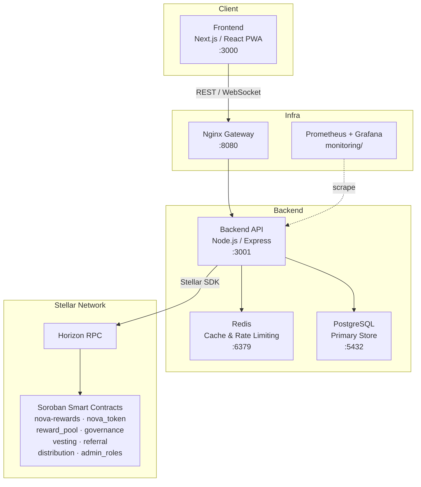

<p align="center">
  
</p>

<h1 align="center">Nova Rewards</h1>

<p align="center">
  A blockchain-powered loyalty platform that lets businesses issue tokenized rewards on the Stellar network.
</p>

<p align="center">
  <a href="https://github.com/barry01-hash/Nova-Rewards/actions/workflows/ci.yml"></a>
  <a href="docs/audits/wcag-accessibility-audit.md"></a>
  <a href="docs/security/README.md"></a>
</p>

---

## Overview

Nova Rewards replaces fragmented, opaque loyalty programs with on-chain token issuance. Merchants create reward campaigns; users earn, hold, and redeem NOVA tokens directly from a crypto wallet. Every transaction is verifiable on Stellar — no black-box points systems.

**Who this repo is for:**
- **Developers** building integrations or contributing features
- **Merchants** evaluating the platform or self-hosting
- **Contributors** looking for a starting point

---

## Architecture



**Key directories:**

| Path | What lives there |
|------|-----------------|
| `novaRewards/frontend/` | Next.js PWA — pages, components, stores |
| `novaRewards/backend/` | Express API — routes, services, DB repos |
| `contracts/` | Soroban smart contracts (Rust) |
| `novaRewards/database/` | SQL migrations (run in order) |
| `monitoring/` | Prometheus, Grafana, Alertmanager configs |
| `infra/` | Terraform modules (VPC, RDS, EC2, ElastiCache) |
| `k8s/` | Kubernetes manifests + Helm chart |
| `docs/` | All extended documentation |

---

## Tech Stack

| Layer | Technology |
|-------|-----------|
| Blockchain | Stellar |
| Smart Contracts | Soroban (Rust, `wasm32v1-none`) |
| Frontend | Next.js 14, React, Tailwind CSS, Zustand |
| Backend | Node.js 20, Express, PostgreSQL 16, Redis 7 |
| Auth | JWT (access + refresh tokens) |
| Wallet | Freighter browser extension |
| Infra | Docker Compose, Kubernetes, Helm, Terraform |
| Monitoring | Prometheus, Grafana, Alertmanager |
| CI/CD | GitHub Actions |

---

## Quick Start

> Gets you running locally in under 15 minutes.

### Prerequisites

| Tool | Version | Install |
|------|---------|---------|
| Node.js | ≥ 20 | [nodejs.org](https://nodejs.org) |
| Rust (stable) | see `rust-toolchain.toml` | [rustup.rs](https://rustup.rs) |
| Stellar CLI | latest | [developers.stellar.org](https://developers.stellar.org/docs/tools/cli/install-cli) |
| Docker Desktop | latest | [docker.com](https://www.docker.com/products/docker-desktop) |
| Freighter wallet | latest | [freighter.app](https://www.freighter.app) |

### 1 — Clone

```bash
git clone https://github.com/barry01-hash/Nova-Rewards.git
cd Nova-Rewards
```

### 2 — Start infrastructure (Postgres + Redis + Backend + Frontend)

```bash
cd novaRewards
cp .env.example .env          # fill in secrets — see Environment Setup below
docker compose up --build
```

Services come up at:
- Frontend → http://localhost:3000
- Backend API → http://localhost:3001
- Nginx gateway → http://localhost:8080

### 3 — Set up Soroban contracts

**POSIX:**
```bash
./scripts/setup-soroban-dev.sh   # installs wasm32v1-none target, adds local network
./scripts/build-contracts.sh     # compiles all contracts to WASM
./scripts/test-contracts.sh      # runs contract test suite
```

**PowerShell:**
```powershell
./scripts/setup-soroban-dev.ps1
./scripts/build-contracts.ps1
./scripts/test-contracts.ps1
```

### 4 — (Optional) Local Stellar testnet

```bash
./scripts/start-local-testnet.sh      # starts a standalone Soroban/Stellar node
```

```powershell
./scripts/start-local-testnet.ps1
```

### 5 — Run application tests

```bash
cd novaRewards
npm run test:backend    # Jest — backend unit + integration
npm run test:frontend   # Jest — frontend components
```

For disclosure policy, scope, severity, and reward tiers, see [SECURITY.md](./SECURITY.md).

---

## Environment Setup

Copy `novaRewards/.env.example` to `novaRewards/.env` and fill in the required values:

```bash
cp novaRewards/.env.example novaRewards/.env
```

**Required variables:**

| Variable | Description |
|----------|-------------|
| `ISSUER_PUBLIC` / `ISSUER_SECRET` | Stellar issuer keypair (creates NOVA asset) |
| `DISTRIBUTION_PUBLIC` / `DISTRIBUTION_SECRET` | Stellar distribution keypair |
| `STELLAR_NETWORK` | `testnet` (dev) or `mainnet` (prod) |
| `DATABASE_URL` | PostgreSQL connection string |
| `REDIS_URL` | Redis connection string |
| `JWT_SECRET` | Long random string for signing JWTs |
| `NEXT_PUBLIC_API_URL` | Backend URL visible to the browser |

For Vercel deployments see `.env.vercel.example`. For production infrastructure see `infrastructure/.env.example`.

> Never commit `.env` files. They are in `.gitignore`.

---

## Contributing

1. **Find or create an issue** — all work is tracked in GitHub Issues.
2. **Branch** off `main`:
   ```
   feat/<short-description>
   fix/<short-description>
   docs/<short-description>
   ```
3. **Run checks** before pushing:
   ```bash
   npm run lint && npm run test
   # contracts:
   cargo fmt --all && cargo clippy -- -D warnings && cargo test
   ```
4. **Open a PR** against `main` — fill in the PR template and link the issue.
5. **Two approvals** required before merge. PRs are squash-merged.

Full details: [docs/pr-process.md](docs/pr-process.md) · [docs/code-style.md](docs/code-style.md)

---

## License

This project is proprietary. All rights reserved © Nova Rewards.  
See [LICENSE](LICENSE) for terms, or contact the maintainers for licensing inquiries.

---

## Documentation Index

| Document | Description |
|----------|-------------|
| [docs/PRD.md](docs/PRD.md) | Product requirements and roadmap |
| [docs/architecture.md](docs/architecture.md) | Detailed system architecture |
| [docs/contracts.md](docs/contracts.md) | Contract addresses, deploy & upgrade instructions |
| [docs/abi-reference.md](docs/abi-reference.md) | Full ABI — function signatures, events, integration examples |
| [docs/error-codes.md](docs/error-codes.md) | Contract error codes and remediation |
| [docs/api/README.md](docs/api/README.md) | REST API overview |
| [docs/api/openapi.json](docs/api/openapi.json) | OpenAPI 3.0 spec |
| [docs/deployment/guides.md](docs/deployment/guides.md) | Deployment guides (Docker, K8s, Vercel) |
| [docs/security/README.md](docs/security/README.md) | Security overview |
| [docs/security/threat-model.md](docs/security/threat-model.md) | Threat model |
| [docs/security/security-best-practices.md](docs/security/security-best-practices.md) | Security best practices |
| [docs/stellar/integration.md](docs/stellar/integration.md) | Stellar / Horizon integration guide |
| [docs/tokenomics.md](docs/tokenomics.md) | Token economics |
| [docs/ops/runbook.md](docs/ops/runbook.md) | Operations runbook |
| [monitoring/README.md](monitoring/README.md) | Monitoring stack setup |
| [contracts/README.md](contracts/README.md) | Smart contracts overview |
| [novaRewards/README.md](novaRewards/README.md) | App-level setup (frontend + backend) |
| [infrastructure/README_DEVOPS_SETUP.md](infrastructure/README_DEVOPS_SETUP.md) | DevOps / infra setup |
| [ROADMAP.md](ROADMAP.md) | Issue tracker and priorities |
