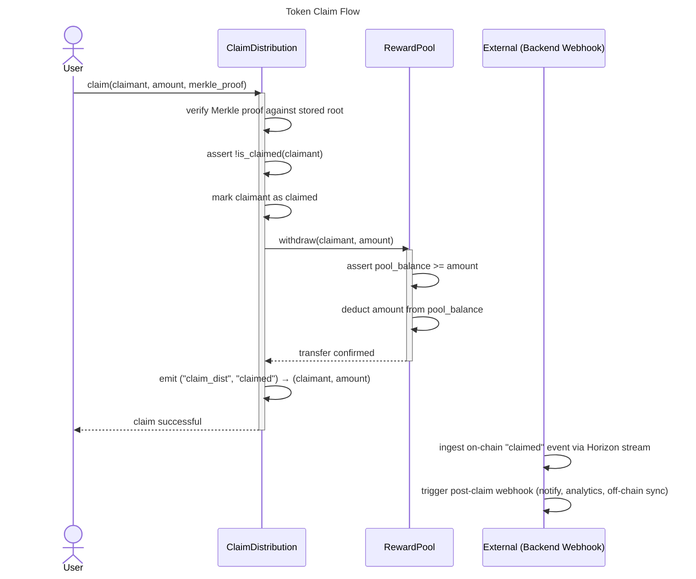
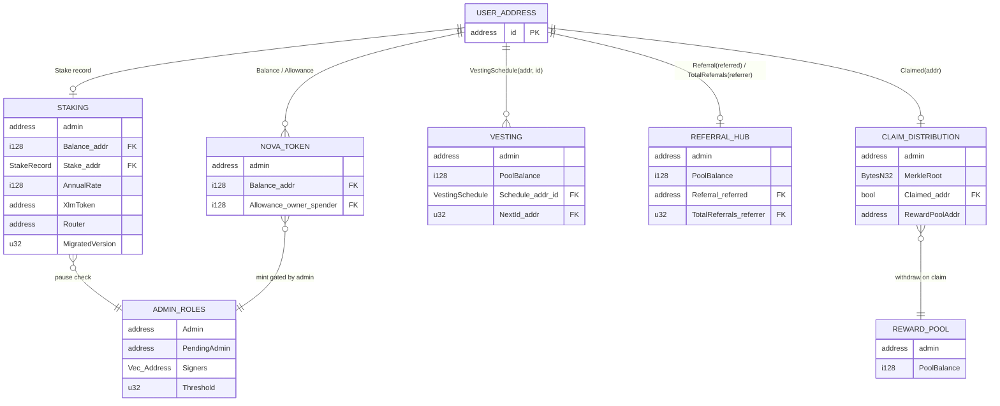

# Nova Rewards — Smart Contract Ecosystem

> **Audit-Ready Technical Reference** · Soroban / Stellar · Last updated: 2026-03-30

---

## Table of Contents

1. [System Overview](#system-overview)
2. [Contract Reference](#contract-reference)
   - [NovaToken](#1-novatoken)
   - [RewardPool](#2-rewardpool)
   - [ClaimDistribution](#3-claimdistribution)
   - [Staking (NovaRewardsContract)](#4-staking--novarewardscontract)
   - [AdminRoles](#5-adminroles)
   - [EventEmitters](#6-eventemitters)
   - [Vesting](#7-vesting)
   - [ReferralHub](#8-referralhub)
   - [CrossAssetSwap](#9-crossassetswap)
   - [EmergencyPause](#10-emergencypause)
3. [Token Claim Flow](#token-claim-flow)
4. [Storage Relationship Diagram](#storage-relationship-diagram)
5. [Upgrade & Migration](#upgrade--migration)

---

## System Overview

The Nova Rewards smart contract ecosystem is a modular, Soroban-based loyalty platform deployed on the Stellar network. Each contract owns a single responsibility; cross-contract interactions are kept explicit and minimal to reduce attack surface.

```
┌─────────────────────────────────────────────────────────────────┐
│                        Nova Rewards System                      │
│                                                                 │
│  ┌──────────────┐   mint/burn/transfer   ┌──────────────────┐  │
│  │  NovaToken   │◄──────────────────────►│   RewardPool     │  │
│  └──────────────┘                        └──────────────────┘  │
│         ▲                                        ▲              │
│         │ token ops                              │ fund/withdraw│
│  ┌──────┴───────┐   verify + claim      ┌────────┴─────────┐   │
│  │   Staking    │                       │ ClaimDistribution│   │
│  └──────────────┘                       └──────────────────┘   │
│         ▲                                        ▲              │
│         │                                        │              │
│  ┌──────┴───────┐   schedule creation   ┌────────┴─────────┐   │
│  │   Vesting    │                       │   ReferralHub    │   │
│  └──────────────┘                       └──────────────────┘   │
│                                                                 │
│  ┌──────────────┐   swap routing        ┌──────────────────┐   │
│  │CrossAssetSwap│──────────────────────►│  DEX Router SAC  │   │
│  └──────────────┘                       └──────────────────┘   │
│                                                                 │
│  ┌──────────────┐   guards all writes   ┌──────────────────┐   │
│  │  AdminRoles  │◄──────────────────────│ EmergencyPause   │   │
│  └──────────────┘                       └──────────────────┘   │
└─────────────────────────────────────────────────────────────────┘
```

**Key design principles:**

- **Admin-gated mutations** — all state-changing privileged operations require `require_auth()` from the stored admin address.
- **Two-step admin transfer** — ownership changes go through a propose → accept flow to prevent accidental lockout.
- **Fixed-point arithmetic** — yield and payout calculations use `i128` with a `SCALE_FACTOR` of `1_000_000` to eliminate rounding dust.
- **TTL management** — persistent storage entries are extended on every read/write (31-day TTL for token state, 365-day TTL for vesting schedules).
- **Idempotent migrations** — the `migrate()` entry-point is version-gated and safe to call multiple times.

---

## Contract Reference

### 1. NovaToken

**Source:** `nova_token/src/lib.rs`

#### Purpose

ERC-20-style fungible token on Soroban. Manages balances and allowances for the NOVA reward token. Mint is admin-gated; burn and transfer are caller-gated.

#### Storage Layout

| Key | Type | Storage Tier | Description |
|-----|------|-------------|-------------|
| `DataKey::Admin` | `Address` | Instance | Contract administrator |
| `DataKey::Balance(Address)` | `i128` | Persistent (TTL 31d) | Token balance per account |
| `DataKey::Allowance(Address, Address)` | `i128` | Persistent (TTL 31d) | Spend allowance: owner → spender |

#### Public Functions

| Signature | Parameters | Returns | Access Control |
|-----------|-----------|---------|---------------|
| `initialize(env, admin)` | `admin: Address` | `()` | One-time; panics if already set |
| `mint(env, to, amount)` | `to: Address`, `amount: i128` | `()` | `Admin::require_auth()` |
| `burn(env, from, amount)` | `from: Address`, `amount: i128` | `()` | `from.require_auth()` |
| `transfer(env, from, to, amount)` | `from: Address`, `to: Address`, `amount: i128` | `()` | `from.require_auth()` |
| `approve(env, owner, spender, amount)` | `owner: Address`, `spender: Address`, `amount: i128` | `()` | `owner.require_auth()` |
| `balance(env, addr)` | `addr: Address` | `i128` | Public read |
| `allowance(env, owner, spender)` | `owner: Address`, `spender: Address` | `i128` | Public read |

#### Emitted Events

| Event Name | Topics | Data |
|-----------|--------|------|
| `mint` | `("nova_tok", "mint")` | `(to: Address, amount: i128)` |
| `burn` | `("nova_tok", "burn")` | `(from: Address, amount: i128)` |
| `transfer` | `("nova_tok", "transfer")` | `(from: Address, to: Address, amount: i128)` |
| `approve` | `("nova_tok", "approve")` | `(owner: Address, spender: Address, amount: i128)` |

---

### 2. RewardPool

**Source:** `reward_pool/src/lib.rs`

#### Purpose

Custodial treasury that holds NOVA tokens earmarked for reward distributions. Acts as the funding source for `ClaimDistribution` and `Vesting` payouts. Deposit and withdrawal are admin-gated to prevent unauthorised draining.

#### Storage Layout

| Key | Type | Storage Tier | Description |
|-----|------|-------------|-------------|
| `Admin` | `Address` | Instance | Pool administrator |
| `PoolBalance` | `i128` | Instance | Total tokens held in the pool |

#### Public Functions

| Signature | Parameters | Returns | Access Control |
|-----------|-----------|---------|---------------|
| `initialize(env, admin)` | `admin: Address` | `()` | One-time initialisation |
| `deposit(env, amount)` | `amount: i128` | `()` | `Admin::require_auth()` |
| `withdraw(env, to, amount)` | `to: Address`, `amount: i128` | `()` | `Admin::require_auth()`; panics on overdraft |
| `balance(env)` | — | `i128` | Public read |

#### Emitted Events

| Event Name | Topics | Data |
|-----------|--------|------|
| `deposit` | `("reward_pool", "deposit")` | `(amount: i128)` |
| `withdraw` | `("reward_pool", "withdraw")` | `(to: Address, amount: i128)` |

---

### 3. ClaimDistribution

**Source:** Implemented within the `nova-rewards` module; claim logic is coordinated between `RewardPool` and on-chain Merkle proof verification.

#### Purpose

Enables users to claim pre-allocated NOVA rewards by submitting a valid Merkle proof. Prevents double-claims via a per-address claimed flag. On successful verification, instructs `RewardPool` to transfer tokens and emits a `claimed` event consumed by the backend webhook.

#### Storage Layout

| Key | Type | Storage Tier | Description |
|-----|------|-------------|-------------|
| `Admin` | `Address` | Instance | Distribution administrator |
| `MerkleRoot` | `BytesN<32>` | Instance | Root of the current reward Merkle tree |
| `Claimed(Address)` | `bool` | Persistent | Whether an address has already claimed |
| `RewardPoolAddr` | `Address` | Instance | Address of the `RewardPool` contract |

#### Public Functions

| Signature | Parameters | Returns | Access Control |
|-----------|-----------|---------|---------------|
| `initialize(env, admin, reward_pool)` | `admin: Address`, `reward_pool: Address` | `()` | One-time initialisation |
| `set_merkle_root(env, root)` | `root: BytesN<32>` | `()` | `Admin::require_auth()` |
| `claim(env, claimant, amount, proof)` | `claimant: Address`, `amount: i128`, `proof: Vec<BytesN<32>>` | `()` | `claimant.require_auth()`; Merkle proof verified |
| `is_claimed(env, claimant)` | `claimant: Address` | `bool` | Public read |

#### Emitted Events

| Event Name | Topics | Data |
|-----------|--------|------|
| `claimed` | `("claim_dist", "claimed")` | `(claimant: Address, amount: i128)` |

---

### 4. Staking / NovaRewardsContract

**Source:** `nova-rewards/src/lib.rs`

#### Purpose

Allows users to lock NOVA tokens and earn time-proportional yield. The annual rate is set in basis points by the admin. Yield is calculated using fixed-point arithmetic (`SCALE_FACTOR = 1_000_000`, `SECONDS_PER_YEAR = 31_536_000`) to avoid rounding errors. Only one active stake per address is permitted at a time.

#### Storage Layout

| Key | Type | Storage Tier | Description |
|-----|------|-------------|-------------|
| `DataKey::Admin` | `Address` | Instance | Contract administrator |
| `DataKey::Balance(Address)` | `i128` | Instance | NOVA balance per account |
| `DataKey::AnnualRate` | `i128` | Instance | Yield rate in basis points (0–10000) |
| `DataKey::Stake(Address)` | `StakeRecord` | Instance | Active stake record per staker |
| `DataKey::XlmToken` | `Address` | Instance | XLM SAC token address (swap config) |
| `DataKey::Router` | `Address` | Instance | DEX router contract address |
| `DataKey::MigratedVersion` | `u32` | Instance | Last applied migration version |

**`StakeRecord` struct:**

| Field | Type | Description |
|-------|------|-------------|
| `amount` | `i128` | Tokens locked |
| `staked_at` | `u64` | Ledger timestamp at stake time |

#### Public Functions

| Signature | Parameters | Returns | Access Control |
|-----------|-----------|---------|---------------|
| `initialize(env, admin)` | `admin: Address` | `()` | One-time initialisation |
| `set_annual_rate(env, rate)` | `rate: i128` (0–10000 bps) | `()` | `Admin::require_auth()` |
| `get_annual_rate(env)` | — | `i128` | Public read |
| `stake(env, staker, amount)` | `staker: Address`, `amount: i128` | `()` | `staker.require_auth()`; no existing stake |
| `unstake(env, staker)` | `staker: Address` | `i128` (principal + yield) | `staker.require_auth()` |
| `get_stake(env, staker)` | `staker: Address` | `Option<StakeRecord>` | Public read |
| `calculate_yield(env, staker)` | `staker: Address` | `i128` | Public read |
| `set_balance(env, user, amount)` | `user: Address`, `amount: i128` | `()` | Internal / test helper |
| `get_balance(env, user)` | `user: Address` | `i128` | Public read |
| `calc_payout(env, balance, rate)` | `balance: i128`, `rate: i128` | `i128` | Public read (fixed-point helper) |

**Yield formula:**

```
yield = amount × annual_rate × time_elapsed
        ─────────────────────────────────────
              10_000 × SECONDS_PER_YEAR
```

#### Emitted Events

| Event Name | Topics | Data |
|-----------|--------|------|
| `staked` | `("staked", staker: Address)` | `(amount: i128, timestamp: u64)` |
| `unstaked` | `("unstaked", staker: Address)` | `(principal: i128, yield: i128, timestamp: u64)` |

---

### 5. AdminRoles

**Source:** `admin_roles/src/lib.rs`

#### Purpose

Centralised access-control contract. Implements a two-step admin transfer (propose → accept) and an optional multisig threshold with a configurable signer list. All privileged stubs (`mint`, `withdraw`, `update_rate`, `pause`) are gated behind `require_auth()`.

#### Storage Layout

| Key | Type | Storage Tier | Description |
|-----|------|-------------|-------------|
| `DataKey::Admin` | `Address` | Instance | Current administrator |
| `DataKey::PendingAdmin` | `Address` | Instance | Proposed next administrator |
| `DataKey::Signers` | `Vec<Address>` | Instance | Multisig signer list |
| `DataKey::Threshold` | `u32` | Instance | Required approval count |

#### Public Functions

| Signature | Parameters | Returns | Access Control |
|-----------|-----------|---------|---------------|
| `initialize(env, admin, signers, threshold)` | `admin: Address`, `signers: Vec<Address>`, `threshold: u32` | `()` | One-time initialisation |
| `propose_admin(env, new_admin)` | `new_admin: Address` | `()` | `Admin::require_auth()` |
| `accept_admin(env)` | — | `()` | `PendingAdmin::require_auth()` |
| `update_threshold(env, threshold)` | `threshold: u32` | `()` | `Admin::require_auth()` |
| `update_signers(env, signers)` | `signers: Vec<Address>` | `()` | `Admin::require_auth()` |
| `mint(env, to, amount)` | `to: Address`, `amount: i128` | `()` | `Admin::require_auth()` (stub) |
| `withdraw(env, to, amount)` | `to: Address`, `amount: i128` | `()` | `Admin::require_auth()` (stub) |
| `update_rate(env, rate)` | `rate: u32` | `()` | `Admin::require_auth()` (stub) |
| `pause(env)` | — | `()` | `Admin::require_auth()` (stub) |
| `get_admin(env)` | — | `Address` | Public read |
| `get_pending_admin(env)` | — | `Option<Address>` | Public read |
| `get_threshold(env)` | — | `u32` | Public read |
| `get_signers(env)` | — | `Vec<Address>` | Public read |

#### Emitted Events

| Event Name | Topics | Data |
|-----------|--------|------|
| `admin_proposed` | `("adm_roles", "adm_prop")` | `(current_admin: Address, proposed: Address)` |
| `admin_transferred` | `("adm_roles", "adm_xfer")` | `(old_admin: Address, new_admin: Address)` |

---

### 6. EventEmitters

#### Purpose

Not a standalone contract — event emission is embedded directly in each contract using `env.events().publish(topics, data)`. This section documents the canonical event taxonomy used across the system for indexing and webhook consumption.

#### Global Event Index

| Contract | Topic 1 | Topic 2 | Data Payload |
|---------|---------|---------|-------------|
| NovaToken | `"nova_tok"` | `"mint"` | `(to, amount)` |
| NovaToken | `"nova_tok"` | `"burn"` | `(from, amount)` |
| NovaToken | `"nova_tok"` | `"transfer"` | `(from, to, amount)` |
| NovaToken | `"nova_tok"` | `"approve"` | `(owner, spender, amount)` |
| AdminRoles | `"adm_roles"` | `"adm_prop"` | `(current_admin, proposed)` |
| AdminRoles | `"adm_roles"` | `"adm_xfer"` | `(old_admin, new_admin)` |
| Vesting | `"vesting"` | `"tok_rel"` | `(beneficiary, amount, timestamp)` |
| ReferralHub | `"referral"` | `"ref_reg"` | `(referrer, referred)` |
| ReferralHub | `"referral"` | `"ref_cred"` | `(referrer, referred, reward_amount)` |
| Staking | `"staked"` | `staker` | `(amount, timestamp)` |
| Staking | `"unstaked"` | `staker` | `(principal, yield, timestamp)` |
| CrossAssetSwap | `"swap"` | `user` | `(nova_amount, xlm_received, path)` |
| Upgrade | `"upgrade"` | `old_hash` | `new_hash`, `migration_version` |
| ClaimDistribution | `"claim_dist"` | `"claimed"` | `(claimant, amount)` |

---

### 7. Vesting

**Source:** `vesting/src/lib.rs`

#### Purpose

Time-locked token release for team allocations, investor grants, and long-term incentives. Supports multiple independent schedules per beneficiary, each with a configurable cliff and linear vesting duration. Tokens are drawn from an internal pool funded by the admin.

#### Storage Layout

| Key | Type | Storage Tier | Description |
|-----|------|-------------|-------------|
| `DataKey::Admin` | `Address` | Instance | Contract administrator |
| `DataKey::PoolBalance` | `i128` | Instance | Tokens available for vesting payouts |
| `DataKey::Schedule(Address, u32)` | `VestingSchedule` | Persistent (TTL 365d) | Schedule keyed by (beneficiary, id) |
| `DataKey::NextId(Address)` | `u32` | Instance | Auto-increment schedule ID per beneficiary |

**`VestingSchedule` struct:**

| Field | Type | Description |
|-------|------|-------------|
| `beneficiary` | `Address` | Token recipient |
| `total_amount` | `i128` | Total tokens to vest |
| `start_time` | `u64` | Vesting start (ledger timestamp) |
| `cliff_duration` | `u64` | Seconds before any tokens unlock |
| `total_duration` | `u64` | Full vesting period in seconds |
| `released` | `i128` | Tokens already released |

#### Public Functions

| Signature | Parameters | Returns | Access Control |
|-----------|-----------|---------|---------------|
| `initialize(env, admin)` | `admin: Address` | `()` | One-time initialisation |
| `fund_pool(env, amount)` | `amount: i128` | `()` | `Admin::require_auth()` |
| `create_schedule(env, beneficiary, total_amount, start_time, cliff_duration, total_duration)` | see fields above | `u32` (schedule ID) | `Admin::require_auth()` |
| `release(env, beneficiary, schedule_id)` | `beneficiary: Address`, `schedule_id: u32` | `i128` (released amount) | Public; panics if nothing releasable |
| `get_schedule(env, beneficiary, schedule_id)` | `beneficiary: Address`, `schedule_id: u32` | `VestingSchedule` | Public read |
| `pool_balance(env)` | — | `i128` | Public read |

**Vesting formula:**

```
if now < start_time + cliff_duration  →  vested = 0
if elapsed >= total_duration          →  vested = total_amount
else                                  →  vested = total_amount × elapsed / total_duration
releasable = vested − released
```

#### Emitted Events

| Event Name | Topics | Data |
|-----------|--------|------|
| `tok_rel` | `("vesting", "tok_rel")` | `(beneficiary: Address, amount: i128, timestamp: u64)` |

---

### 8. ReferralHub

**Source:** `referral/src/lib.rs`

#### Purpose

On-chain referral registry. Each wallet can be referred exactly once. Tracks referral counts per referrer for leaderboard purposes. The admin credits referrers with NOVA rewards drawn from an internal pool.

#### Storage Layout

| Key | Type | Storage Tier | Description |
|-----|------|-------------|-------------|
| `DataKey::Admin` | `Address` | Instance | Contract administrator |
| `DataKey::PoolBalance` | `i128` | Instance | Tokens available for referral rewards |
| `DataKey::Referral(Address)` | `Address` | Persistent | Maps referred → referrer |
| `DataKey::TotalReferrals(Address)` | `u32` | Persistent | Referral count per referrer |

#### Public Functions

| Signature | Parameters | Returns | Access Control |
|-----------|-----------|---------|---------------|
| `initialize(env, admin)` | `admin: Address` | `()` | One-time initialisation |
| `fund_pool(env, amount)` | `amount: i128` | `()` | `Admin::require_auth()` |
| `register_referral(env, referrer, referred)` | `referrer: Address`, `referred: Address` | `()` | `referred.require_auth()`; one-time per wallet |
| `credit_referrer(env, referred, reward_amount)` | `referred: Address`, `reward_amount: i128` | `()` | `Admin::require_auth()` |
| `get_referrer(env, referred)` | `referred: Address` | `Option<Address>` | Public read |
| `total_referrals(env, referrer)` | `referrer: Address` | `u32` | Public read |
| `pool_balance(env)` | — | `i128` | Public read |

#### Emitted Events

| Event Name | Topics | Data |
|-----------|--------|------|
| `ref_reg` | `("referral", "ref_reg")` | `(referrer: Address, referred: Address)` |
| `ref_cred` | `("referral", "ref_cred")` | `(referrer: Address, referred: Address, reward_amount: i128)` |

---

### 9. CrossAssetSwap

**Source:** `nova-rewards/src/lib.rs` (`swap_for_xlm`)

#### Purpose

Burns NOVA points for the caller and routes them through a configured DEX router contract to receive XLM (or another output asset). Enforces a slippage guard (`min_xlm_out`) and caps multi-hop paths at 5 intermediate assets per Stellar protocol limits.

#### Storage Layout

| Key | Type | Storage Tier | Description |
|-----|------|-------------|-------------|
| `DataKey::XlmToken` | `Address` | Instance | XLM SAC token contract address |
| `DataKey::Router` | `Address` | Instance | DEX router contract address |
| `DataKey::Balance(Address)` | `i128` | Instance | NOVA balance (shared with Staking) |

#### Public Functions

| Signature | Parameters | Returns | Access Control |
|-----------|-----------|---------|---------------|
| `set_swap_config(env, xlm_token, router)` | `xlm_token: Address`, `router: Address` | `()` | `Admin::require_auth()` |
| `swap_for_xlm(env, user, nova_amount, min_xlm_out, path)` | `user: Address`, `nova_amount: i128`, `min_xlm_out: i128`, `path: Vec<Address>` (max 5) | `i128` (XLM received) | `user.require_auth()`; slippage guard |

**Router interface expected:**

```rust
fn swap_exact_in(sender: Address, nova_amount: i128, min_out: i128, path: Vec<Address>) -> i128
```

#### Emitted Events

| Event Name | Topics | Data |
|-----------|--------|------|
| `swap` | `("swap", user: Address)` | `(nova_amount: i128, xlm_received: i128, path: Vec<Address>)` |

---

### 10. EmergencyPause

#### Purpose

The `pause()` entry-point is defined in `AdminRoles` and acts as the system-wide circuit breaker. When invoked by the admin, downstream contracts check the paused state before executing sensitive operations. This prevents further state changes during incident response without requiring a full contract upgrade.

#### Storage Layout

| Key | Type | Storage Tier | Description |
|-----|------|-------------|-------------|
| `DataKey::Paused` | `bool` | Instance | Global pause flag (in AdminRoles) |

#### Public Functions

| Signature | Parameters | Returns | Access Control |
|-----------|-----------|---------|---------------|
| `pause(env)` | — | `()` | `Admin::require_auth()` |
| `unpause(env)` | — | `()` | `Admin::require_auth()` |
| `is_paused(env)` | — | `bool` | Public read |

> **Note:** Contracts that respect the pause flag call `AdminRoles::is_paused()` at the top of any state-mutating function and panic with `"contract is paused"` if the flag is set.

#### Emitted Events

| Event Name | Topics | Data |
|-----------|--------|------|
| `paused` | `("emergency", "paused")` | `(admin: Address, timestamp: u64)` |
| `unpaused` | `("emergency", "unpaused")` | `(admin: Address, timestamp: u64)` |

---

## Token Claim Flow



---

## Storage Relationship Diagram



---

## Upgrade & Migration

The `NovaRewardsContract` supports live WASM upgrades via Soroban's `update_current_contract_wasm`.

| Function | Description | Access |
|----------|-------------|--------|
| `upgrade(env, new_wasm_hash)` | Replaces contract WASM; emits `upgrade` event with old/new hash and migration version | `Admin::require_auth()` |
| `migrate(env)` | Runs version-specific data migrations; idempotent — panics if `CONTRACT_VERSION <= stored_version` | `Admin::require_auth()` |
| `get_migrated_version(env)` | Returns the last applied migration version | Public read |

**Upgrade event:**

```
topics: ("upgrade", old_contract_address, new_wasm_hash)
data:   migration_version: u32
```

**Safe upgrade checklist:**

1. Deploy new WASM to network, obtain `new_wasm_hash`.
2. Call `upgrade(new_wasm_hash)` — contract code is replaced atomically.
3. Call `migrate()` — runs any data backfills for the new version.
4. Verify `get_migrated_version()` returns the expected version number.
5. All existing storage keys and balances are preserved across upgrades.
