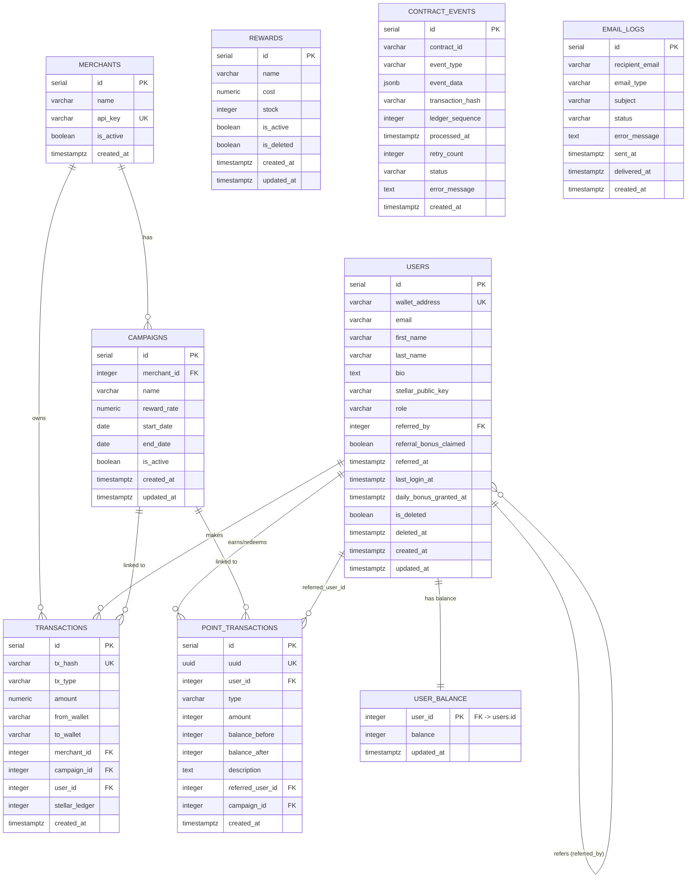

# NovaRewards — Entity Relationship Diagram

Generated: 2026-03-28

## ERD (Mermaid)

## Key Design Decisions

### point_transactions
| Column | Type | Notes |
|---|---|---|
| `id` | SERIAL | Internal auto-increment PK |
| `uuid` | UUID | Stable external identifier (gen_random_uuid()) |
| `user_id` | INTEGER FK | Owner of the transaction |
| `type` | VARCHAR CHECK | `earned` \| `redeemed` \| `expired` \| `bonus` \| `referral` |
| `amount` | INTEGER | Always positive; sign is derived from `type` |
| `balance_before` | INTEGER | Snapshot of balance before this transaction |
| `balance_after` | INTEGER | Snapshot of balance after this transaction |
| `description` | TEXT | Human-readable reason |
| `referred_user_id` | INTEGER FK | Set for `referral` type transactions |
| `campaign_id` | INTEGER FK | Optional campaign linkage |
| `created_at` | TIMESTAMPTZ | Immutable insert timestamp |

**DB-level constraints:**
- `amount <> 0` — zero-value transactions are rejected at the DB layer
- `balance_after >= 0` — balance can never go negative
- `type IN (...)` — enum enforced by CHECK constraint

### user_balance
Maintained by the `trg_sync_user_balance` AFTER INSERT trigger on `point_transactions`.  
Every insert atomically upserts `user_balance.balance = NEW.balance_after`.  
The service layer acquires a `FOR UPDATE` lock on the `user_balance` row before computing `balance_before` / `balance_after`, preventing race conditions under concurrent writes.

### Concurrency safety
`recordPointTransaction()` in `pointTransactionRepository.js`:
1. Opens a transaction
2. `INSERT ... ON CONFLICT DO NOTHING` to ensure the `user_balance` row exists
3. `SELECT ... FOR UPDATE` to lock the row
4. Computes delta, validates `balanceAfter >= 0`
5. Inserts the `point_transactions` row (trigger fires, updates `user_balance`)
6. Commits
