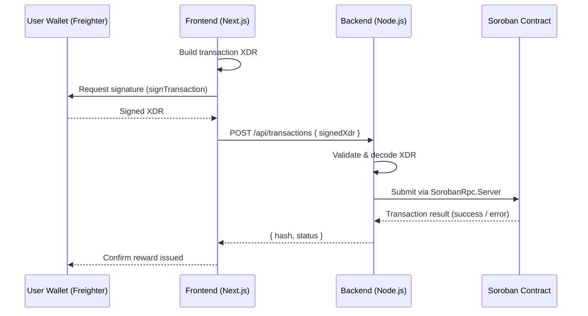

# Stellar & Soroban Integration Guide

> **Prerequisite:** Read [CONTRIBUTING.md](../../CONTRIBUTING.md) before proceeding.

---

## 1. Stellar Account Model

Every participant on Stellar is identified by a **keypair**:

| Component | Description |
|-----------|-------------|
| **Public Key** (`G…`) | Account address — share freely |
| **Secret Key** (`S…`) | Signs transactions — never expose |
| **Sequence Number** | Monotonically increasing counter preventing replay attacks |
| **Base Reserve** | Minimum XLM balance (0.5 XLM per entry) |

An account must be **funded** (≥ 1 XLM base reserve) before it can transact.

### Horizon Base URLs

| Network | Base URL |
|---------|----------|
| **Testnet** | `https://horizon-testnet.stellar.org` |
| **Mainnet** | `https://horizon.stellar.org` |

---

## 2. Annotated TypeScript Snippets

### 2.1 Loading an Account

```typescript
import { Horizon, Keypair } from "@stellar/stellar-sdk";

const server = new Horizon.Server("https://horizon-testnet.stellar.org");

// Load account state (sequence number, balances, etc.)
const account = await server.loadAccount(Keypair.random().publicKey());
// account.balances → array of { asset_type, balance }
// account.sequence → current sequence number (auto-incremented per tx)
```

### 2.2 Submitting a Transaction

```typescript
import {
  Horizon,
  Keypair,
  TransactionBuilder,
  Networks,
  Operation,
  Asset,
  BASE_FEE,
} from "@stellar/stellar-sdk";

const server = new Horizon.Server("https://horizon-testnet.stellar.org");
const sourceKeypair = Keypair.fromSecret(process.env.STELLAR_SECRET!);

async function sendPayment(destination: string, amount: string) {
  // 1. Load source account to get current sequence number
  const sourceAccount = await server.loadAccount(sourceKeypair.publicKey());

  // 2. Build the transaction
  const tx = new TransactionBuilder(sourceAccount, {
    fee: BASE_FEE,
    networkPassphrase: Networks.TESTNET, // Networks.PUBLIC for mainnet
  })
    .addOperation(
      Operation.payment({
        destination,
        asset: Asset.native(), // XLM; swap for custom Asset for NOVA tokens
        amount,
      })
    )
    .setTimeout(30) // transaction expires in 30 seconds
    .build();

  // 3. Sign with the source secret key
  tx.sign(sourceKeypair);

  // 4. Submit — throws HorizonAxiosError on failure
  const result = await server.submitTransaction(tx);
  return result.hash; // transaction hash on-chain
}
```

### 2.3 Listening for Payments via EventSource

```typescript
import { Horizon } from "@stellar/stellar-sdk";

const server = new Horizon.Server("https://horizon-testnet.stellar.org");

// Streams server-sent events; cursor="now" skips historical records
server
  .payments()
  .forAccount("<ACCOUNT_PUBLIC_KEY>")
  .cursor("now")
  .stream({
    onmessage: (payment) => {
      if (payment.type !== "payment") return;
      console.log(`Received ${payment.amount} ${payment.asset_code ?? "XLM"}`);
    },
    onerror: (err) => console.error("Stream error:", err),
  });
```

### 2.4 Parsing Soroban Contract Events

```typescript
import { SorobanRpc, xdr, scValToNative } from "@stellar/stellar-sdk";

const rpc = new SorobanRpc.Server("https://soroban-testnet.stellar.org");

async function getContractEvents(contractId: string, startLedger: number) {
  const { events } = await rpc.getEvents({
    startLedger,
    filters: [
      {
        type: "contract",
        contractIds: [contractId],
        // Filter by topic — e.g. ["reward_issued"] matches the first topic segment
        topics: [["*"]],
      },
    ],
  });

  return events.map((e) => ({
    // Decode each topic from XDR ScVal to a native JS value
    topics: e.topic.map((t) => scValToNative(xdr.ScVal.fromXDR(t, "base64"))),
    // Decode the event body value
    value: scValToNative(xdr.ScVal.fromXDR(e.value, "base64")),
    ledger: e.ledger,
  }));
}
```

---

## 3. End-to-End Flow



---

## 4. Horizon Error Reference

| Error Code | HTTP Status | Cause | Recommended Handling |
|------------|-------------|-------|----------------------|
| `tx_failed` | 400 | One or more operations failed | Inspect `result_codes.operations[]`; surface specific op error to user |
| `op_underfunded` | 400 | Source account lacks sufficient balance | Prompt user to top up; show current balance from `loadAccount` |
| `op_bad_auth` | 400 | Invalid or missing signature | Re-request wallet signature; verify correct network passphrase |
| `tx_insufficient_fee` | 400 | Fee below network minimum | Use `server.fetchBaseFee()` to get current base fee dynamically |
| `tx_too_late` | 400 | Transaction expired (`setTimeout` exceeded) | Rebuild transaction with a fresh sequence number and resubmit |

### Error Handling Pattern

```typescript
import { HorizonAxiosError } from "@stellar/stellar-sdk";

try {
  await server.submitTransaction(tx);
} catch (err) {
  if (err instanceof HorizonAxiosError) {
    const codes = err.response?.data?.extras?.result_codes;
    // codes.transaction → e.g. "tx_failed"
    // codes.operations  → e.g. ["op_underfunded"]
    console.error("Horizon error:", codes);
  }
  throw err;
}
```

---

## 5. Further Reading

- [Stellar Developer Docs](https://developers.stellar.org)
- [Soroban Documentation](https://soroban.stellar.org)
- [Nova Rewards Contract Events](../contract-events.md)
