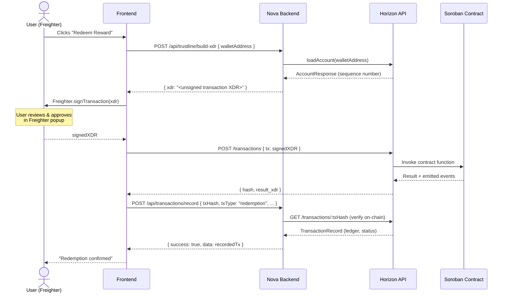

# Stellar Integration Reference

Developer reference for how Nova Rewards uses the Stellar SDK and Horizon REST API.

---

## Stellar Account Model

Every participant on Stellar is identified by an **Ed25519 keypair**:

| Term                | Description                                       |
| ------------------- | ------------------------------------------------- |
| Public key (`G...`) | 56-char address, safe to share                    |
| Secret key (`S...`) | Signs transactions — never expose                 |
| Sequence number     | Monotonically-increasing nonce per account        |
| Base reserve        | 0.5 XLM per account + 0.5 XLM per trustline/offer |

Nova Rewards uses two server-side accounts:

- **Issuer Account** — creates and signs the `NOVA` asset into existence
- **Distribution Account** — holds the circulating supply and sends rewards to users

User wallets are external (e.g. Freighter). The backend never holds a user's secret key.

---

## Horizon Base URLs

```
Testnet:  https://horizon-testnet.stellar.org
Mainnet:  https://horizon.stellar.org
```

Configured via `HORIZON_URL` in `.env`. The shared server instance lives in
`novaRewards/blockchain/stellarService.js`:

```typescript
import { Horizon } from "@stellar/stellar-sdk";

// Reads HORIZON_URL at startup — falls back to testnet
const server = new Horizon.Server(
  process.env.HORIZON_URL ?? "https://horizon-testnet.stellar.org",
);
```

---

## How the Backend Authenticates Requests

Nova Rewards uses two separate auth layers — one for merchants, one for users.

### Merchant API Key (server-to-server)

Merchants include their API key in every request:

```
x-api-key: <merchant_api_key>
```

`authenticateMerchant` middleware looks up the key in PostgreSQL and attaches
`req.merchant` on success. All reward distribution endpoints require this header.

### User JWT (browser / mobile)

Users authenticate via email/password and receive a short-lived JWT:

```
Authorization: Bearer <access_token>
```

`authenticateUser` middleware verifies the JWT with `jsonwebtoken`, then fetches
the full user row from the database and attaches it as `req.user`.

| Token         | Expiry | Purpose                 |
| ------------- | ------ | ----------------------- |
| Access token  | 15 min | API calls               |
| Refresh token | 7 days | Obtain new access token |

Secrets are set via `JWT_SECRET`, `JWT_EXPIRES_IN`, and `JWT_REFRESH_EXPIRES_IN`.

---

## Annotated Code Snippets

### 1 — Loading an Account

```typescript
import { Horizon } from "@stellar/stellar-sdk";

const server = new Horizon.Server("https://horizon-testnet.stellar.org");

async function loadAccount(publicKey: string) {
  // Throws HorizonError (status 404) if the account is unfunded
  const account = await server.loadAccount(publicKey);

  // account.balances is an array of all asset balances
  const xlm = account.balances.find((b) => b.asset_type === "native");
  const nova = account.balances.find(
    (b) => b.asset_type !== "native" && b.asset_code === "NOVA",
  );

  console.log("XLM:", xlm?.balance ?? "0");
  console.log("NOVA:", nova?.balance ?? "0 (no trustline)");

  return account;
}
```

### 2 — Submitting a Transaction

This is how `sendRewards.js` distributes NOVA tokens server-side:

```typescript
import {
  Keypair,
  TransactionBuilder,
  Operation,
  Memo,
  Networks,
  BASE_FEE,
  Asset,
} from "@stellar/stellar-sdk";

const NOVA = new Asset("NOVA", process.env.ISSUER_PUBLIC!);
const NETWORK_PASSPHRASE =
  process.env.STELLAR_NETWORK === "mainnet"
    ? Networks.PUBLIC
    : Networks.TESTNET;

async function sendNova(toWallet: string, amount: string) {
  const distributionKeypair = Keypair.fromSecret(
    process.env.DISTRIBUTION_SECRET!,
  );

  // 1. Load the source account to get the current sequence number
  const sourceAccount = await server.loadAccount(
    distributionKeypair.publicKey(),
  );

  // 2. Build the transaction
  const tx = new TransactionBuilder(sourceAccount, {
    fee: BASE_FEE,
    networkPassphrase: NETWORK_PASSPHRASE,
  })
    .addOperation(
      Operation.payment({
        destination: toWallet,
        asset: NOVA,
        amount, // e.g. "10.0000000"
      }),
    )
    .addMemo(Memo.text("NovaRewards distribution"))
    .setTimeout(180) // seconds before the tx is rejected by the network
    .build();

  // 3. Sign with the distribution account's secret key
  tx.sign(distributionKeypair);

  // 4. Submit — throws HorizonError on failure
  const result = await server.submitTransaction(tx);
  return result.hash; // 64-char hex transaction hash
}
```

### 3 — Listening to Payment Events via EventSource

Horizon exposes a streaming endpoint for real-time payment events. Use the
browser's native `EventSource` (or `eventsource` npm package on Node):

```typescript
import { Horizon, Asset } from "@stellar/stellar-sdk";

const server = new Horizon.Server("https://horizon-testnet.stellar.org");
const NOVA = new Asset("NOVA", process.env.NEXT_PUBLIC_ISSUER_PUBLIC!);

function streamPayments(walletAddress: string) {
  // .stream() returns a close() function
  const close = server
    .payments()
    .forAccount(walletAddress)
    .cursor("now") // only new events from this point forward
    .stream({
      onmessage(payment) {
        // Filter for NOVA payments only
        if (
          payment.type === "payment" &&
          (payment as any).asset_code === NOVA.code &&
          (payment as any).asset_issuer === NOVA.issuer
        ) {
          console.log("Received NOVA:", (payment as any).amount);
        }
      },
      onerror(err) {
        console.error("Stream error:", err);
        // Reconnect after a short delay
        setTimeout(() => streamPayments(walletAddress), 5_000);
      },
    });

  // Call close() to stop the stream
  return close;
}
```

> The stream uses `text/event-stream` under the hood. Horizon automatically
> reconnects on network interruptions, but you should implement your own
> back-off on `onerror` for production use.

### 4 — Parsing Soroban Contract Events

Soroban events are returned by Horizon's `/events` endpoint. Each event has
a `topic` array (XDR-encoded `ScVal`) and a `value` (XDR-encoded `ScVal`).

```typescript
import { xdr, scValToNative } from "@stellar/stellar-sdk";

interface NovaEvent {
  contractId: string;
  type: string;
  data: unknown;
  txHash: string;
  ledger: number;
}

function parseContractEvent(raw: any): NovaEvent | null {
  try {
    // topics[0] = contract name symbol, topics[1] = event type symbol
    const [contractNameVal, eventTypeVal] = raw.topic.map((t: string) =>
      xdr.ScVal.fromXDR(t, "base64"),
    );

    const contractName = scValToNative(contractNameVal) as string;
    const eventType = scValToNative(eventTypeVal) as string;

    // Decode the event payload
    const valueXdr = xdr.ScVal.fromXDR(raw.value.xdr, "base64");
    const data = scValToNative(valueXdr);

    return {
      contractId: raw.contractId,
      type: `${contractName}:${eventType}`, // e.g. "nova_tok:mint"
      data,
      txHash: raw.txHash,
      ledger: raw.ledger,
    };
  } catch {
    return null; // unknown or malformed event
  }
}

// Example: fetch recent events for the NOVA token contract
async function fetchContractEvents(contractId: string) {
  const response = await fetch(
    `https://horizon-testnet.stellar.org/events?contract_id=${contractId}&limit=20`,
  );
  const { _embedded } = await response.json();
  return _embedded.records.map(parseContractEvent).filter(Boolean);
}
```

See `docs/contract-events.md` for the full event schema (topics + data shapes)
for every Nova contract.

---

## Sequence Diagram — Wallet Signature to Soroban Invocation



**Key points:**

- The backend never sees the user's secret key — only the signed XDR
- The backend verifies the transaction exists on Horizon before writing to the DB
- Soroban contract events are emitted during the Horizon → SC step and can be
  consumed via the `/events` endpoint or the polling loop in `contractEventService.js`

---

## Horizon Error Codes

### `tx_failed`

The transaction envelope was valid but one or more operations failed.
Check `extras.result_codes.operations` for the per-operation code.

```typescript
try {
  await server.submitTransaction(tx);
} catch (err: any) {
  if (err.response?.data?.extras?.result_codes?.transaction === "tx_failed") {
    const opCodes = err.response.data.extras.result_codes.operations;
    // e.g. ["op_underfunded"] or ["op_bad_auth"]
    console.error("Operation failures:", opCodes);
  }
}
```

Nova backend behaviour: returns HTTP 500 with `error: "internal_server_error"`.
The raw Stellar error is logged server-side for debugging.

---

### `op_underfunded`

The source account does not have enough of the asset to cover the payment
(or enough XLM to cover the base reserve + fee).

Nova backend behaviour: `issueAsset.js` and `sendRewards.js` both catch this
code and re-throw a human-readable `Error` with `err.code = "insufficient_balance"`.
The rewards route returns HTTP 500; the client should prompt the merchant to
top up the distribution account.

```typescript
// From issueAsset.js
if (
  error.response?.data?.extras?.result_codes?.operations?.includes(
    "op_underfunded",
  )
) {
  throw new Error(
    "Insufficient XLM balance to cover transaction fees. Please fund the account.",
  );
}
```

---

### `op_bad_auth`

The transaction was not signed by the required key(s), or the signature is
invalid / expired.

Nova backend behaviour: this should never occur for server-signed transactions
(distribution account). If it does, it surfaces as an unhandled 500. For
client-signed XDR flows (trustline, redemption), the frontend submits directly
to Horizon — the error is returned to the user by Horizon before the backend
is involved.

---

## Quick Reference — Common Horizon HTTP Errors

| HTTP | Horizon error         | Meaning                      | Nova handling                                   |
| ---- | --------------------- | ---------------------------- | ----------------------------------------------- |
| 400  | `tx_failed`           | Op-level failure             | Log + 500                                       |
| 400  | `tx_bad_seq`          | Sequence number mismatch     | Reload account + retry                          |
| 400  | `tx_insufficient_fee` | Fee below network minimum    | Increase `BASE_FEE`                             |
| 404  | —                     | Account not found (unfunded) | Return `{ exists: false }` for trustline checks |
| 429  | —                     | Horizon rate limit           | Exponential back-off                            |

---

## Further Reading

- [Stellar Developer Docs](https://developers.stellar.org/docs)
- [Horizon API Reference](https://developers.stellar.org/api/horizon)
- [Soroban Events](https://developers.stellar.org/docs/learn/encyclopedia/contract-development/events)
- [Freighter Wallet API](https://docs.freighter.app)
- `docs/contract-events.md` — Nova contract event schema
- `docs/upgrade-guide.md` — Soroban contract upgrade procedure
