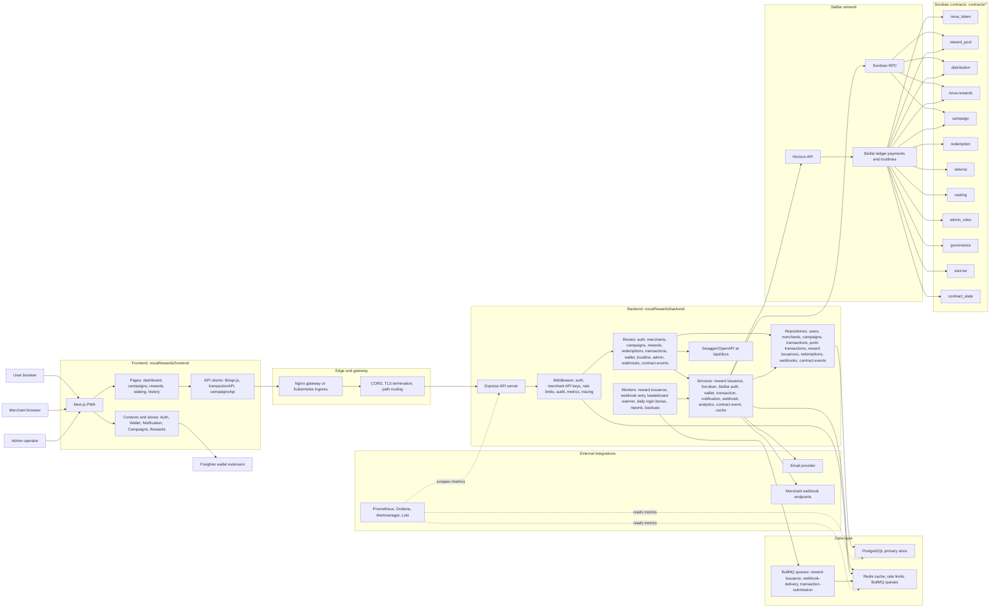
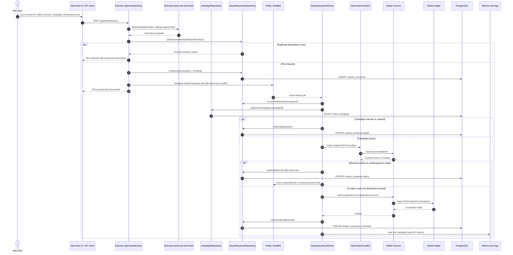
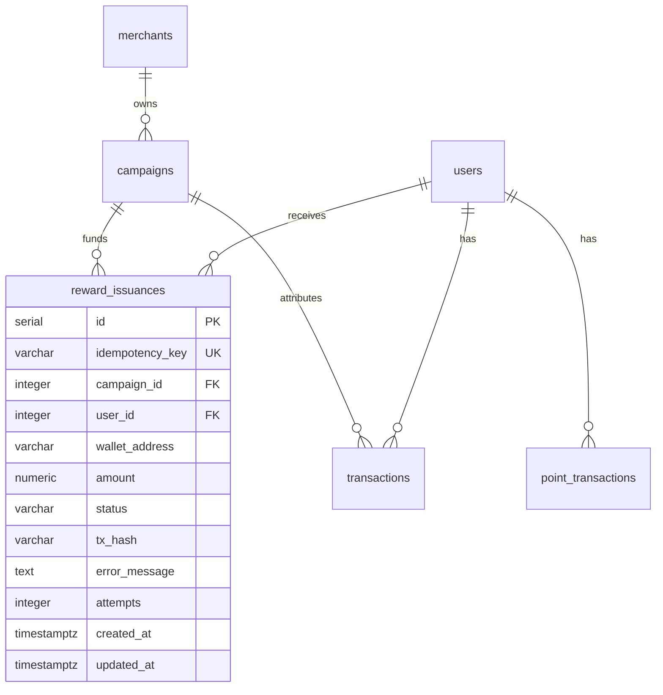
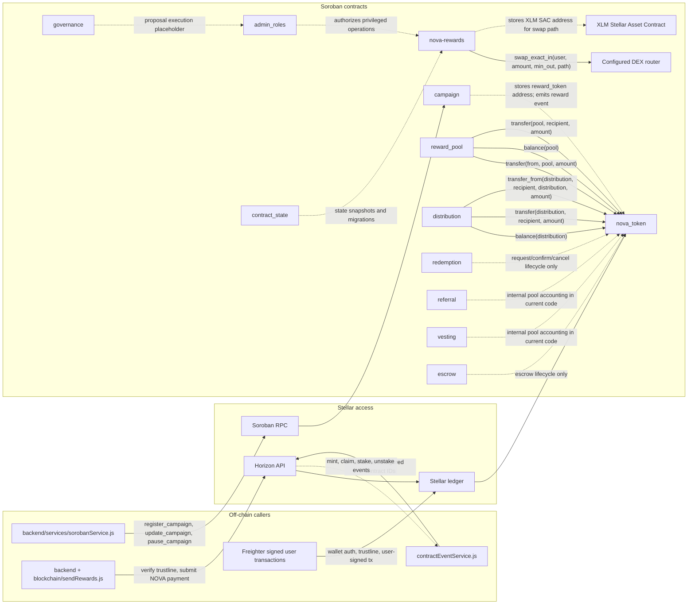

# Nova Rewards System Design

This document is the diagram-as-code source for issue #668. The diagrams are
written in Mermaid so they can be reviewed in pull requests and kept close to
the code paths they describe.

## Scope

The diagrams cover the currently implemented Nova Rewards platform:

- `novaRewards/frontend`: Next.js PWA, Freighter wallet integration, API clients,
  Zustand stores, and user/merchant views.
- `novaRewards/backend`: Express API, middleware, service layer, repositories,
  BullMQ workers, contract event indexing, webhooks, and observability.
- `novaRewards/database`: PostgreSQL migrations for merchants, users, campaigns,
  reward issuances, point transactions, redemptions, webhooks, and contract
  events.
- `novaRewards/blockchain`: Stellar Horizon payment and trustline helpers.
- `contracts`: Soroban contracts in the workspace.
- `helm`, `k8s`, `infra`, and `novaRewards/docker-compose*.yml`: deployment
  topologies for staging and production.

## Acceptance Criteria Map

| Issue #668 requirement | Where it is covered |
| --- | --- |
| Component diagram showing all services and interactions | [Component Diagram](#component-diagram) |
| Data flow diagram for reward issuance end-to-end | [Reward Issuance Data Flow](#reward-issuance-data-flow) |
| Contract interaction diagram showing cross-contract calls | [Contract Interaction Diagram](#contract-interaction-diagram) |
| Deployment topology diagram for staging and production | [Deployment Topology](#deployment-topology) |
| At least 5 ADRs for key design choices | [Architecture Decision Records](#architecture-decision-records) |

## Component Diagram

## Reward Issuance Data Flow

The primary issuance path is asynchronous: merchants call
`POST /api/rewards/issue`, the API creates an idempotent database record, and a
BullMQ worker performs the Stellar distribution. The older
`POST /api/rewards/distribute` route performs similar checks and distribution
synchronously.

### Reward Issuance Persistence

## Contract Interaction Diagram

This diagram distinguishes actual cross-contract calls from off-chain backend
invocations. Standalone contracts still appear so contract ownership is visible.

Cross-contract calls in source:

| Caller | Target | Source | Calls |
| --- | --- | --- | --- |
| `reward_pool` | `nova_token` | `contracts/reward_pool/src/lib.rs` | `transfer`, `balance` |
| `distribution` | `nova_token` | `contracts/distribution/src/lib.rs` | `balance`, `transfer`, `transfer_from` |
| `nova-rewards` | configured DEX router | `contracts/nova-rewards/src/lib.rs` | `swap_exact_in` |
| Backend Soroban service | `campaign` contract | `novaRewards/backend/services/sorobanService.js` | `register_campaign`, `update_campaign`, `pause_campaign` |
| Backend payment helper | Stellar ledger / NOVA asset | `novaRewards/blockchain/sendRewards.js` | Horizon payment operation |

## Deployment Topology

```mermaid
flowchart TB
    developer["Developer or CI"]
    stellarTestnet["Stellar testnet / Soroban testnet"]
    stellarMainnet["Stellar public network / Soroban mainnet"]

    subgraph staging["Staging: novaRewards/docker-compose.staging.yml"]
        stgGateway["Nginx gateway :8080"]
        stgFrontend["Frontend container :3000"]
        stgBackend["Backend container :3001"]
        stgMigrate["One-shot migration container"]
        stgPostgres["PostgreSQL staging database"]
        stgRedis["Redis single node"]
        stgVolumes["Docker volumes: postgres_data, redis_data"]
    end

    subgraph prodAws["Production: AWS infrastructure from infra/"]
        publicSubnets["Public subnets"]
        privateSubnets["Private subnets"]
        alb["Application Load Balancer with HTTPS"]
        asg["EC2 Auto Scaling Group or Kubernetes worker nodes"]
        rds["RDS PostgreSQL 16, private, encrypted, Multi-AZ"]
        elasticache["ElastiCache Redis, encrypted, auth token"]
        secrets["AWS Secrets Manager"]
        cloudwatch["CloudWatch"]
    end

    subgraph prodK8s["Production app runtime: helm/nova-rewards"]
        ingress["Nginx Ingress with TLS secret"]
        frontendPods["Frontend Deployment, 3 replicas in production override"]
        backendPods["Backend Deployment, 3 replicas in production override"]
        hpa["HorizontalPodAutoscaler"]
        pdb["PodDisruptionBudget"]
        configMap["ConfigMap: NODE_ENV, PORT, NEXT_PUBLIC_API_URL"]
        k8sSecrets["nova-rewards-secrets"]
        services["ClusterIP Services for frontend and backend"]
    end

    subgraph observability["Observability"]
        prometheus["Prometheus"]
        grafana["Grafana"]
        alertmanager["Alertmanager"]
        loki["Loki and Promtail"]
    end

    developer -->|"docker compose -f docker-compose.staging.yml up"| stgGateway
    stgGateway --> stgFrontend
    stgGateway --> stgBackend
    stgMigrate --> stgPostgres
    stgBackend --> stgPostgres
    stgBackend --> stgRedis
    stgPostgres --> stgVolumes
    stgRedis --> stgVolumes
    stgBackend --> stellarTestnet

    developer -->|"terraform apply"| prodAws
    developer -->|"helm upgrade --install -f values-production.yaml"| prodK8s
    alb --> ingress
    ingress --> services
    services --> frontendPods
    services --> backendPods
    hpa --> frontendPods
    hpa --> backendPods
    pdb --> frontendPods
    pdb --> backendPods
    configMap --> frontendPods
    configMap --> backendPods
    k8sSecrets --> backendPods
    secrets --> asg
    asg --> privateSubnets
    alb --> publicSubnets
    backendPods --> rds
    backendPods --> elasticache
    backendPods --> stellarMainnet
    cloudwatch -.->|"metrics and logs"| asg
    prometheus -.->|"scrape /metrics"| backendPods
    grafana --> prometheus
    alertmanager --> prometheus
    loki -.->|"logs"| backendPods
```

### Environment Differences

| Concern | Staging | Production |
| --- | --- | --- |
| Runtime | Docker Compose from `novaRewards/docker-compose.staging.yml` | Helm chart in `helm/nova-rewards` on AWS-managed infrastructure |
| Frontend | One container, `NODE_ENV=staging` | 3 replicas with production override and HPA |
| Backend | One container, conservative DB pool | 3 replicas with production override, HPA, health probes |
| Database | Compose PostgreSQL volume | Private encrypted RDS PostgreSQL 16, Multi-AZ |
| Cache and queues | Single Redis container | Encrypted ElastiCache Redis |
| Network | Nginx gateway on `:8080` | ALB/Ingress with TLS |
| Secrets | `.env.staging` for compose | Kubernetes secret plus AWS Secrets Manager |
| Chain | Testnet endpoints | Mainnet/public endpoints after contract IDs are configured |

## Architecture Decision Records

The ADRs live in `docs/adr/`:

- [ADR 0001: Layered PWA and Express API](adr/0001-layered-pwa-and-express-api.md)
- [ADR 0002: PostgreSQL System of Record with Redis Operational Cache](adr/0002-postgresql-system-of-record-with-redis-operational-cache.md)
- [ADR 0003: Stellar and Soroban for Reward Settlement](adr/0003-stellar-and-soroban-for-reward-settlement.md)
- [ADR 0004: Idempotent Asynchronous Reward Issuance](adr/0004-idempotent-asynchronous-reward-issuance.md)
- [ADR 0005: Modular Soroban Contracts with Explicit Cross-Contract Calls](adr/0005-modular-soroban-contracts.md)
- [ADR 0006: Compose for Staging and Helm on AWS for Production](adr/0006-deployment-topology.md)
