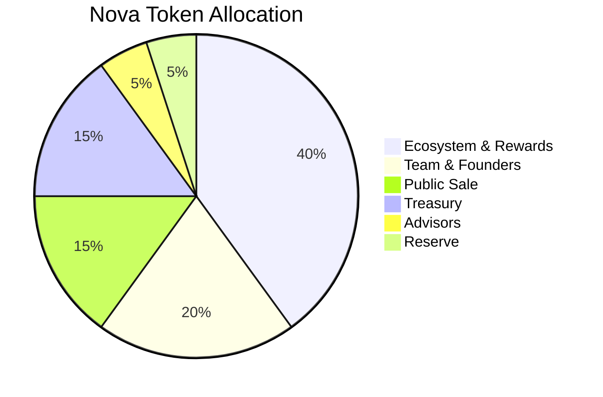

# Nova Rewards — Tokenomics

> **Note:** Values marked `<placeholder>` are not defined in the codebase and must be confirmed by the team before publication.

---

## Total Supply

| Parameter | Value |
|-----------|-------|
| Supply Cap | `<TOTAL_SUPPLY>` |
| Token Symbol | NOVA |
| Decimals | `<placeholder>` |
| Blockchain | Stellar (Soroban) |

> The `nova_token` contract uses an admin-gated `mint()` function with no hardcoded supply cap. The team must define and enforce `<TOTAL_SUPPLY>` at the application layer or add a `MAX_SUPPLY` constant to `contracts/nova_token/src/lib.rs`.

---

## Initial Allocation

> **Note:** Percentages below are placeholders — not confirmed in the codebase.



| Category | % of Supply | Token Amount |
|----------|-------------|--------------|
| Ecosystem & Rewards | 40% | `<placeholder>` |
| Team & Founders | 20% | `<placeholder>` |
| Public Sale | 15% | `<placeholder>` |
| Treasury | 15% | `<placeholder>` |
| Advisors | 5% | `<placeholder>` |
| Reserve | 5% | `<placeholder>` |

---

## Vesting Schedules

| Category | Cliff | Vesting Period | Release |
|----------|-------|----------------|---------|
| Team | 12 months | 36 months | Monthly linear |
| Advisors | 6 months | 24 months | Monthly linear |
| Public Sale | None | 6 months | Monthly linear |
| Ecosystem | None | 48 months | Monthly linear |

> Vesting logic is implemented in `contracts/vesting/src/lib.rs`.

---

## Token Supply Metrics

Circulating supply at key milestones, based on vesting schedules above.

| Milestone | Circulating Supply | % of Total |
|-----------|-------------------|------------|
| Launch (Day 1) | `<placeholder>` | `<placeholder>`% |
| 6 months | `<placeholder>` | `<placeholder>`% |
| 12 months | `<placeholder>` | `<placeholder>`% |
| 24 months | `<placeholder>` | `<placeholder>`% |
| 36 months | `<placeholder>` | `<placeholder>`% |
| Max (fully diluted) | `<TOTAL_SUPPLY>` | 100% |

> Fill in once `<TOTAL_SUPPLY>` and allocation amounts are confirmed.

---

## Deflationary Mechanisms

### Token Burn on Redemption

The `nova_token` contract exposes a `burn(from, amount)` function that permanently removes tokens from circulation. The `nova-rewards` contract calls this when users swap Nova points for XLM via `swap_for_xlm()`.

| Parameter | Value |
|-----------|-------|
| Burn trigger | User calls `swap_for_xlm()` — full `nova_amount` is burned |
| Redemption fee burn rate | `<placeholder>`% of each redemption fee |
| Fee destination | `<placeholder>` (treasury / burn address) |

> The current contract burns the full swap amount. A partial fee-burn mechanism (e.g. X% to treasury, Y% burned) is not yet implemented — confirm with the smart contract team.

### Burn-Rate Projection

Projected annual token burn under three adoption scenarios. Fill in once `<TOTAL_SUPPLY>` and fee rates are confirmed.

| Scenario | Annual Redemption Volume | Burn Rate | Tokens Burned / Year |
|----------|--------------------------|-----------|----------------------|
| Low adoption | `<placeholder>` | `<placeholder>`% | `<placeholder>` |
| Moderate adoption | `<placeholder>` | `<placeholder>`% | `<placeholder>` |
| High adoption | `<placeholder>` | `<placeholder>`% | `<placeholder>` |

---

## Staking Yield Model

### APY Formula

Staking yield is calculated using continuous time-weighted accrual:

```
APY = (Annual Rewards Distributed / Total Staked) × 100
```

The on-chain implementation in `contracts/nova-rewards/src/lib.rs` uses:

```
yield = amount × annual_rate × time_elapsed / (10_000 × SECONDS_PER_YEAR)
```

Where:
- `annual_rate` — set by admin in basis points (0–10000; e.g. `500` = 5% APY)
- `time_elapsed` — seconds between `staked_at` and `unstake()` call
- `SECONDS_PER_YEAR` — `31_536_000` (365 days)

### Treasury Funding

Staking rewards are funded from the Treasury allocation (`<placeholder>`% of total supply). The admin mints reward tokens to the staking contract as needed, or the contract draws from a pre-funded reward pool.

### Sustainability Note

Yield is sustainable while the Treasury reserve covers emissions. As the treasury balance decreases, the admin should reduce `annual_rate` proportionally to extend the emission runway. Refer to the [Token Supply Metrics](#token-supply-metrics) table above for projected circulating supply at each milestone.

> Current `annual_rate` is configurable at runtime via `set_annual_rate()` (admin only). No hardcoded rate exists in the contract.

---

## References

| File | Description |
|------|-------------|
| `contracts/nova_token/src/lib.rs` | Token mint, burn, transfer, approve |
| `contracts/nova-rewards/src/lib.rs` | Staking, swap/burn, yield calculation |
| `contracts/vesting/src/lib.rs` | Vesting schedule logic |
| `contracts/reward_pool/src/lib.rs` | Reward pool contract |
| `contracts/referral/src/lib.rs` | Referral reward logic |
| `docs/roadmap.md` | Prioritized delivery roadmap |
